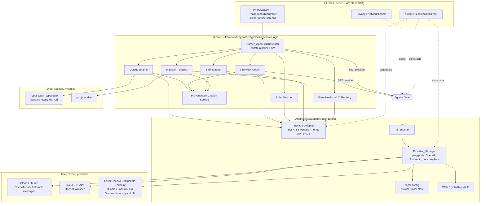
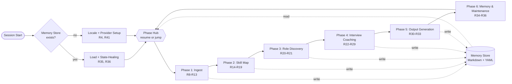
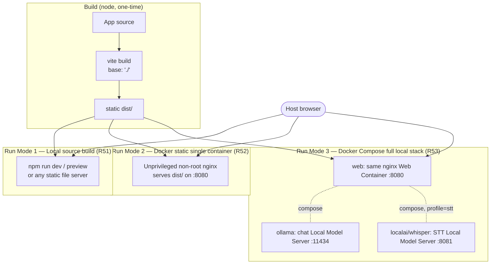
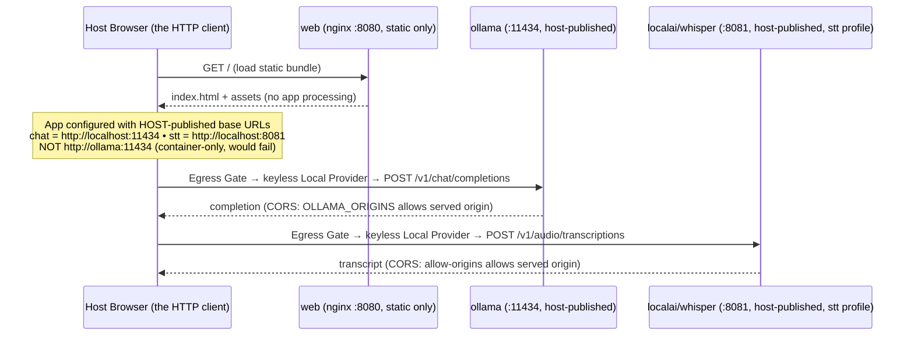

# Design Document

## Overview

Career Agent is a **local-first browser web application** that builds an evidence-backed professional profile, coaches STAR interview answers, and generates ATS-safe job application materials — all on the user's device, with no backend server. This design covers **Phase 1 (Launch)** as scoped by the requirements document, mapping every design decision back to the 58 numbered requirements.

The defining constraint is **trust**: user files never leave the device, and every claim in every generated output is traceable to a source citation or an explicit user confirmation (the No-Fabrication Rule, Requirements 37–40). The only network traffic is user-initiated calls to the user's chosen providers, and only a **Redacted Payload** is ever transmitted (Requirements 6, 7). Two trust-defining behaviours run through the whole pipeline: a **granular, per-file, per-detection ingestion send-control** decision gates everything that could leave the device during ingestion (Requirement 57), and a single **opt-in-first AI-assist** pattern guarantees a complete deterministic result before any provider is ever called (Requirements 14, 20, 22, 28, 30, 47). The user connects either a **keyed cloud provider** via Bring-Your-Own-Key (OpenAI or Anthropic) or a **keyless Local Provider** that targets an OpenAI-Compatible Endpoint running on the user's own machine (Ollama by default; also LocalAI, LM Studio, llama.cpp server, vLLM). The chat/LLM provider and the speech-to-text provider are selected **independently** (Requirement 44), and speech-to-text supports an optional translate-to-English mode (Requirement 26.5). When every selected provider is a Local Provider, no Redacted Payload leaves the device and the application is fully offline (Requirements 1.5, 43.5).

### Design Goals and Constraints (fixed)

These constraints were agreed with the user and are treated as fixed inputs to this design:

1. **Local-first browser web app**, TypeScript + WebAssembly, served from a static bundle with no backend (Requirement 1). Core logic is **packaging-agnostic** so a Tauri wrapper can be added later without rewrites. **Container packaging is an optional delivery layer** (Requirements 50–53): the same static bundle may be served by a local source build, a single hardened static-serving container, or a Docker Compose stack. This packaging layer adds *how the static assets are served*; it never introduces a data or application backend, and the no-backend trust guarantees below hold identically in every Run Mode (see [Deployment and Packaging (Run Modes)](#deployment-and-packaging-run-modes)).
2. **Storage_Adapter, two tiers**: File System Access API on Chromium desktop (real Markdown folder); OPFS/IndexedDB fallback elsewhere with one-click `.zip` export/import (Requirements 2, 3).
3. **Pluggable provider layer** with two provider families: **BYOK keyed cloud** providers (OpenAI, Anthropic) whose keys are validated by a cheap probe and stored encrypted via Web Crypto API and never written to the Memory Store; and a **keyless Local Provider** (no key, user-editable base URL + model names persisted in browser-local storage). Chat and speech-to-text providers are chosen per-capability (Requirements 4, 5, 43, 44, 45).
4. **PII_Scanner**: regex + lightweight JS pattern matching, gating all network transmission (Requirement 6).
5. **Output_Engine**: Typst compiled to WebAssembly for client-side PDF; Markdown always primary; simplified structured DOCX; ATS-safe single-column templates (Requirement 32).
6. **Six-phase pipeline** (Ingest → Skill Map → Role Discovery → Interview Coaching → Output Generation → Memory & Maintenance), stateful and session-resumable (Requirement 35).

### Architectural Principles

- **Separation of core and shell.** All domain logic (parsing, normalisation, matching, provenance, healing, serialisation) lives in framework-agnostic TypeScript modules (`@core/*`). The UI shell and the storage/network/crypto adapters are thin, swappable boundaries. This keeps the core packaging-agnostic (browser today, Tauri later).
- **Markdown is the database.** The Memory Store *is* the canonical state. In-memory objects are a hydrated projection of Markdown that must round-trip losslessly (Requirements 34, 36).
- **Provenance is mandatory, not optional.** Every fact carries a citation from the moment of extraction. Output generation can only emit facts that carry provenance (Requirements 37, 38).
- **Network is a gated boundary.** No domain component calls a provider directly. All provider calls pass through a single egress chokepoint that enforces PII pre-screening and payload minimisation (Requirements 6, 7).
- **Egress is user-decided, per file and per detection.** During ingestion nothing is transmitted until the user has made an explicit send-control decision for that file — either whole-file, or an allow/redact choice for each individual Sensitive Detection — and the Egress Gate refuses to build a payload until that decision exists (Requirement 57).
- **AI is opt-in, deterministic-first.** Every AI-assistable operation has a complete script-only path that makes no provider call; the AI mode is chosen *before* the operation runs and only ever *supplements* the deterministic result, which the user must confirm before it enters the knowledge base (Requirements 14, 20, 22, 28, 30, 47).

## Architecture

### Component Architecture



**Egress Gate** is the single chokepoint through which every outbound provider request flows — **including requests to the Local Provider** (Requirement 7.5). It calls `PII_Scanner` first, builds the Redacted Payload (carrying the `noTraining` flag derived from consent state), attaches a network-operation label for the UI, and only then hands the payload to `Provider_Manager` (Requirements 6, 7, 46). For a keyed cloud destination the label marks a third-party network call; for a Local Provider on-device destination the label marks a **local on-device call with no third-party egress** (Requirement 7.6). For **ingestion file content**, the gate additionally consults the file's **`SendControlDecision`** and refuses to build or transmit any payload for a staged file until that decision is confirmed (Requirements 6.6, 57.1, 57.10) — see [Granular Ingestion Send-Control](#granular-ingestion-send-control-r57). Private-item handling is scoped by destination: for a keyed cloud (third-party) provider, items marked private are excluded from the payload before it reaches the gate (Requirement 46.4), while for a keyless Local Provider on the user's own device with no third-party egress, the payload MAY include private items because it does not leave the device (Requirement 46.5). The chat/LLM provider and the STT provider are addressed independently, so each capability routes through the gate to its own chosen provider (Requirement 44). No domain component is permitted to import a provider client directly; only the `runtime.ts` composition root constructs provider adapters and the gate.

**Payload Preview and user redaction (R65).** Before a **text** payload reaches a **keyed cloud (third-party)** provider, the gate surfaces a **Payload Preview** of the *exact* text to be transmitted; the user may freely edit or remove arbitrary wording, and the transmitted payload is the **user-approved edited text** (R65.1, R65.2). The user can **cancel**, which is **fail-closed**: nothing is transmitted and the prior state is preserved (R65.4). The seam follows the gate's existing **injected, UI-owned callback** pattern (alongside `confirmRedactAndProceed: RedactAndProceedPrompt` and `notifyLabel: LabelNotifier`): a new optional callback `previewPayload?: PayloadPreviewPrompt`, where `PayloadPreviewPrompt = (preview: { provider; operation; text }) => Promise<string | null>` returns the user-approved text or `null` to cancel. The gate stays framework-agnostic — the React shell implements the modal in `App.tsx` / `runtime.ts`, exactly as the existing redact-and-proceed `window.confirm` wiring does. **Ordering in the `request()` text path:** label (R7.3) → *(third-party only)* **Payload Preview** (user edits/cancels) → run the existing local **PII pre-screening on the user-approved text** (R6 still applies as defense in depth, R65.3) → redact-and-proceed if detections (R6.3) → build the minimised Redacted Payload (R6.4, R7.2) → send. The review routes through the **single Egress Gate** (R7.5) so it always occurs before any transmission (R65.6). For a **keyless Local Provider** on the user's own device (`thirdParty = false`, R7.6) the preview is **skipped entirely** because nothing leaves the device (R65.5), matching the existing local-skip behaviour. **Scope boundary:** the Payload Preview targets the **non-ingestion chat/LLM text** operations (`llm-chat` via `request()`) (R65.7); **ingestion** content already has its own granular per-file/per-detection send-control (R57) via `requestIngestion()`, so it is **not** double-prompted with a general preview. STT **audio** is not previewable as text — the resulting **transcript** continues to be confirmed and corrected per R26 (R65.7).

### Phase Pipeline and Data Flow



Each phase reads from and writes to the Memory Store after every confirmed step, so the user can stop at any point — including mid-question (Requirement 25.4) — and resume exactly there (Requirement 35.2). No phase is gated on a later phase. The "New role" and "New job posting" re-entry points jump directly to Phase 3 / Phase 5 using the existing skill map (Requirement 35.3, 35.4, 35.5).

### Egress Sequence (every provider call)

```mermaid
sequenceDiagram
    participant C as Core Component
    participant G as Egress Gate
    participant S as PII_Scanner
    participant U as User
    participant P as Provider_Manager
    participant V as Key Vault (Web Crypto)
    participant X as Chosen Provider (cloud or Local)

    C->>G: request(intent{provider, text, noTraining})
    alt cloud provider
        G->>U: label as third-party network call (R7.3)
        opt llm-chat text payload (R65.7)
            G->>U: Payload Preview — exact outbound text (R65.1)
            U-->>G: approve edited text OR cancel = fail-closed (R65.2, R65.4)
        end
    else Local Provider (on-device)
        G->>U: label as local on-device call, no third-party egress (R7.6)
    end
    G->>S: scan(plaintext)  (private items excluded for keyed cloud third-party R46.4; MAY be included for keyless local on-device R46.5)
    alt ingestion file content (R6.6, R57)
        S-->>G: detections[] per staged file
        G->>U: present per-file send-control: whole-file OR per-detection allow/redact (R57.1, R57.2)
        Note over G,U: cloud default = every detection redacted (R57.6); local MAY send whole file incl. sensitive (R57.5)
        U-->>G: confirm SendControlDecision (gate blocks build until confirmed R57.1)
        G->>G: build payload honouring per-file/per-detection choice (R57.3, R57.4, R57.10)
    else other operation, high-risk pattern found
        S-->>G: detections[]
        G->>U: notify category + offer redact-and-proceed (R6.3)
        U-->>G: accept
        G->>G: build Redacted Payload (R6.4, R7.2)
    else clean
        S-->>G: none
    end
    G->>G: attach noTraining flag from consent (R46.1)
    G->>P: send(minimalRedactedPayload) to chosen capability provider (R44)
    alt keyed cloud provider
        P->>V: decrypt key for this provider only (R5.3)
    else keyless Local Provider
        Note over P,V: no vault decrypt; empty key, auth header omitted (R5.5, R43.2)
    end
    P->>X: provider API call (OpenAI sets store:false when noTraining R46.2)
    X-->>P: response
    P-->>C: response (never persists key, never echoes secrets R5.2,R6.5)
```

The chat/LLM operation and the speech-to-text transcription are separate calls, each carrying the provider the user selected **for that capability** (Requirement 44). Transcription follows the same gated path; the audio is transmitted to the chosen STT provider, and the gate PII-screens the *resulting transcript* before releasing it (Requirement 26.2). When the user selects audio translation, the STT call requests translate-to-English (Requirement 26.5).

### Technology Choices

| Concern | Choice | Rationale (requirement) |
|---|---|---|
| Language / runtime | TypeScript, WebAssembly | Mandated (R1.2) |
| UI framework | React + Vite static SPA (`base: './'`), `@vitejs/plugin-react` 6 | Produces a static bundle that opens from `file://` or a static host with no server (R1.1); core logic kept outside React so it is reusable under Tauri |
| Build toolchain | Vite 8 (Rolldown) + Vitest 4 | Fast static-bundle build and the test runner; one toolchain for dev, bundle, and test |
| Browser polyfill | `Buffer` polyfill (for `gray-matter`) | `gray-matter` frontmatter parsing expects Node's `Buffer`; a browser polyfill keeps Markdown parsing working in the SPA with no backend (R34.2) |
| Pipeline state | XState statechart | Models the resumable six-phase FSM and mid-question pause/resume (R25.4, R35) deterministically |
| UI state store | Zustand (thin, framework-light) | Hydrated projection of Memory Store; no framework lock-in |
| PDF parsing | pdf.js (web worker, bundled via `?url`) | Launch-format PDF extraction with confidence signals (R8.1, R8.5) |
| CSV parsing | PapaParse | LinkedIn ZIP CSV parsing (R8.2) |
| ZIP read/write | JSZip | LinkedIn export read (R8.2) + fallback `.zip` Memory Store export/import (R3) |
| PDF typesetting | `typst.ts` (Typst compiled to Wasm), compiler wasm **bundled locally** via Vite `?url` (no CDN) | Client-side selectable-text ATS PDF (R32.2, R32.6, R42.4); graceful failure never blocks other formats |
| DOCX generation | `docx` (pure-JS OOXML builder, deterministic) | Simplified structured rich-text DOCX (R32.3) |
| Cloud provider clients | OpenAI (chat completions + Whisper STT via `/audio/transcriptions` and `/audio/translations`), Anthropic (messages); key validated by cheap `GET /models` probe | Working keyed cloud integrations and pre-use key validation (R45) |
| Local provider | Generic OpenAI-compatible HTTP client reused with auth header omitted when keyless; config in browser-local storage via `local-config` | Keyless self-hosted endpoint, default Ollama `http://localhost:11434/v1`, editable base URL + models + completion-token limit (R43) |
| Local storage | File System Access API; `idb` over IndexedDB + OPFS | Two-tier Storage_Adapter (R2, R3) |
| Key encryption | Web Crypto API (AES-GCM, key from non-extractable derived key) | Encrypted local key storage for keyed cloud providers (R5.1); Local Provider stores no key (R5.5) |
| Markdown parse/serialise | `remark`/`mdast` + `gray-matter` (frontmatter), `yaml` for config files | Lossless ID round-trip and config resources (R34.2, R16.4, R17.1) |
| Localisation | `i18next` with externalised JSON/YAML locale resource files | Tier-1 en + pt-BR, externalised strings (R41.8) |
| Testing | Vitest 4 + fast-check (property-based) | Dual unit + property testing (Testing Strategy, R40) |

All listed technologies run entirely client-side; none requires a backend. Typst and pdf.js are the WebAssembly components referenced by Requirement 1.2.

## Components and Interfaces

### Career_Agent (Orchestrator)

Owns the XState pipeline, mediates between UI and domain components, and enforces cross-cutting rules (User Override Supremacy R39, network labelling R7.3). It never talks to providers except through the Egress Gate.

```typescript
interface CareerAgent {
  resumeSession(): Promise<SessionSummary>;          // R35.1
  jumpToPhase(phase: Phase): Promise<void>;           // R35.2
  startNewRole(): Promise<void>;                      // R35.3 (Phase 3 w/o re-ingest)
  ingestJobPosting(text: string): Promise<RoleMatch>; // R35.3, R35.6 (Target Opportunity entry)
  applyUserOverride<T>(target: Ref, value: T): Promise<void>; // R39.1 (accept), R39.2 (flag once)
}

interface SessionSummary {        // R35.1
  phaseStates: Record<Phase, PhaseStatus>;
  outstanding: OutstandingItem[]; // unanswered Qs, [needs_metric], unreviewed skills, conflicts
  healingReport: HealingReport;   // R36
}
```

### AI Assist Opt-In-First Pattern (shared)

Four components offer optional AI help — `Skill_Mapper` (skill discovery), `Role_Matcher` (role recommendations), `Interview_Coach` (STAR question generation and educational summaries), and `Output_Engine` (CV tailoring). Rather than each inventing its own opt-in, they share **one** opt-in-first contract so the behaviour is identical everywhere (Requirements 14.5/14.6, 20.4–20.6, 22.4–22.9, 28.5–28.8, 30.5–30.10, 47.7/47.8).

```typescript
type AssistMode = 'script-only' | 'ai-assisted';   // chosen BEFORE the operation runs

interface AssistChoice {
  mode: AssistMode;                 // user's pre-operation selection
  capability: 'skill_discovery' | 'role_discovery' | 'star_questions'
            | 'star_summary' | 'cv_tailoring';
}

// Every AI-assistable operation implements this shape.
interface AssistableOperation<TInput, TResult> {
  // Complete, deterministic result. MUST issue zero provider calls (R14.6, R20.5, R22.5, R28.5, R47.8, R30.7).
  scriptOnly(input: TInput): TResult;
  // Deterministic baseline PLUS provider-derived supplements routed through the Egress Gate.
  // Supplements never replace the baseline and require explicit user confirmation before
  // entering the knowledge base (R22.6 supplement-not-replace, R47.3 confirm-before-entry).
  aiAssisted(input: TInput, dest: EgressDestination): Promise<TResult>;
}
```

**Where the choice is surfaced.** Each phase screen presents the opt-in-first choice (`script-only` vs `script + AI assist`) **before** the operation runs, alongside the network/privacy label for the destination (R58.5). The choice is captured as an `AssistChoice` and passed into the orchestrator, which branches:

- `script-only` → call `operation.scriptOnly(...)` and **never** construct an Egress request. This path is fully functional on its own and is the default trust-preserving route.
- `ai-assisted` → call `operation.scriptOnly(...)` to establish the baseline, then `operation.aiAssisted(...)`, whose provider call is routed through the Egress Gate (PII pre-screening, labelling, private-item exclusion for keyed cloud). AI output is presented as *suggestions* the user confirms; on provider failure the orchestrator falls back to the already-computed script-only baseline and surfaces a non-blocking error (R22.8, R30.7), preserving phase state.

Because the script-only path is a precondition of the AI-assisted path, the deterministic result is always available regardless of provider state — this is the mechanism behind **Correctness Property 19**.

### Ingestion_Engine

Parses launch formats, extracts structured records with confidence and provenance, detects gaps and conflicts, and drives the review/correction UI.

```typescript
interface IngestionEngine {
  acceptedFormats(): Format[];                                  // R8.1 (pdf, md, txt, linkedin-zip)
  ingest(file: FileBlob): Promise<IngestionResult>;             // R8, R10
  parseLinkedInZip(zip: FileBlob): Promise<LinkedInRecords>;    // R8.2 (Profile/Positions/Skills/Certifications CSV)
  rejectUnsupported(file: FileBlob): RejectionNotice;           // R8.3 (deferred-format message)
  recommendedChecklist(locale: Locale): ChecklistItem[];        // R8.4
  reconcile(docs: ExtractedDoc[]): ReconcileResult;             // R9 (merge richest, flag conflicts)
  detectGaps(history: EmploymentRecord[]): EmploymentGap[];     // R10.4, R13
}

interface IngestionResult {
  items: ExtractedItem[];     // each carries confidence + provenance
  conflicts: ConflictRecord[];// R9.2
  lowConfidencePdfText: FlaggedRegion[]; // R8.5
  groupedByDocument: DocumentGroup[];    // R12.1
  rawText: string;            // full document text fed to extraction; persisted to the user-owned Memory Store (profile/raw_documents.md), restored on resume/import, used for LOCAL discovery only
}
```

Extraction pipeline: format detection → text/record extraction (pdf.js / PapaParse / plain read) → per-field record building → **confidence scoring** (High = explicit, Medium = inferred, Low = speculative; R11.1) → **provenance attachment** (source doc + line, R38.1) → reconciliation/conflict detection (R9). Accuracy is prioritised over latency (R42.2); ambiguous documents trigger a clarification prompt rather than an assumption (R42.3). The engine also returns `rawText` — the full document text fed to extraction (the PDF confident text or the raw Markdown/plain-text body; empty for LinkedIn ZIPs). `rawText` is persisted to the **user-owned Memory Store** (`profile/raw_documents.md`, R34.1) — a local file that never leaves the device (R7.1) — and is restored on session resume / Memory import (R49), so it serves as the corpus for whole-document **local-only** AI skill discovery (see Skill_Mapper) even after a reload. It is only ever read by the keyless local on-device discovery path and is never included in a cloud payload (R46.4/R47.1).

**Conversion Preview (R64).** The same `rawText` (and the per-document `lowConfidencePdfText` flagged regions, R8.5) is surfaced to the user as a per-document **read-only Conversion Preview** so they can inspect exactly what was decoded from each ingested document and catch a bad conversion (R64.1). The preview is **inspection-only**: it presents the converted text and **never** allows in-place editing of it (R64.2). Where PDF extraction flagged low-confidence regions, the preview **indicates those regions** so the user can see where extraction was uncertain (R64.3). If the user judges a conversion wrong, they may **discard** that ingested document and supply the equivalent career text through the **existing paste path** (R8.6), rather than editing the converted text (R64.4). For a document with no convertible prose body — e.g. a LinkedIn export ZIP, whose `rawText` is empty — the preview shows a **"no converted text to preview"** notice for that document (R64.5). This is a UI affordance over data the engine already returns (`IngestionResult.rawText`, `lowConfidencePdfText`) and the `profile/raw_documents.md` Memory Store record; it requires **no new @core domain behaviour** beyond what already exists.

### Skill_Mapper

Normalises skills conservatively, enforces never-merge guardrails, builds the bi-directional skill↔accomplishment graph with stable IDs, and produces `skill_map.md`.

```typescript
interface SkillMapper {
  generate(extractions: ExtractedItem[]): SkillMap;             // R14.1 (entry shape), R14.2 (verified-only)
  discover(corpus: DiscoveryCorpus, dest: EgressDestination): AiSkillSuggestion[]; // R47.1/47.5 opt-in: raw document text for local / structured non-private items for cloud, chunked & never truncated, prompt model, parse proposals
  normalise(terms: SkillTerm[]): MergePlan;                     // R15 conservative merge
  isConfusable(a: SkillTerm, b: SkillTerm): boolean;            // R16.3 (from confusables.yaml)
  applyMerge(plan: MergeDecision): MergeRecord;                 // R15.2 logged + reversible
  splitMerge(record: MergeRecord): void;                        // R19.3 one-step reversal
  assignBulletId(acc: Accomplishment): BulletId;                // R18.1 stable, never reused R18.4
  linkEvidence(skill: SkillId, ids: (StarId|BulletId)[]): void; // R18.2, R18.3 bi-directional
  addUserSkill(input: UserSkillInput): void;                    // R19.2 (requires role/project + when)
  recordSelfAssessment(skill: SkillId, s: SelfAssessment): void;// R19.4 (stored separately)
}
```

Normalisation algorithm (Conservative Merge, R15): two surface terms merge **only** if they are case/spelling variants, known abbreviations, or listed synonyms of the *same* skill, **and** the pair is not in `confusables.yaml` (R16.3), **and** neither term is a distinct named product being folded into a generic umbrella (R16.1). Umbrella terms appearing explicitly in source are added as *additional* separate skills (R16.2). Uncertain cases stay separate and raise a single optional merge suggestion (R15.4). The agent never invents implied sub-skills (R15.3).

The default `generate()` path is deterministic and evidence-only (R14) and is unchanged by this feature. Separately, an **opt-in AI skill-discovery flow** (`discover()`) sends its corpus through the Egress Gate **split into chunks rather than a single truncated payload**, so no evidence is silently dropped (R47.5), and asks the user's chosen chat model to propose skills the deterministic extractor may have missed. The corpus depends on the destination scope: for a keyless **Local Provider** running on the user's own device with no third-party egress, it is the **full raw document text** (the `rawText` captured by the Ingestion_Engine and persisted to the user-owned Memory Store at `profile/raw_documents.md`, which never leaves the device per R7.1 and is restored on resume/import per R49, so whole-document discovery survives a reload), so the model can surface skills the structured extractor missed; for a keyed **cloud (third-party) provider**, it is the **structured non-private items only** (the persisted raw text is never read on the cloud path), since raw text carries no per-item private flag (R47.1, R46.4/R46.5). The model only proposes — every AI-discovered skill requires explicit user confirmation before it enters the knowledge base (R47.3), and a confirmed skill is recorded with user-confirmation provenance, consistent with the No-Fabrication Rule (R47.6). Both paths realise the shared **AI Assist Opt-In-First Pattern**: the deterministic `generate()` is the `scriptOnly` path (R14.6, R47.8 — no provider call) and `discover()` is the `aiAssisted` path, chosen via the pre-operation opt-in surfaced on the Skill Map screen (R14.5, R47.7).

### Role_Matcher

Discovers role types, scores matches using ontological inference, and captures preferences.

```typescript
interface RoleMatcher {
  loadTaxonomy(): Taxonomy;                                  // R17.1 from taxonomy.yaml
  satisfies(required: SkillTerm, owned: SkillTerm[]): boolean;// R17.2, R20.3 (child satisfies parent)
  suggestRoles(map: SkillMap, locale: Locale): RoleSuggestion[]; // R20.1 (employed/freelance/portfolio) — scriptOnly path R20.5
  scoreMatch(role: RoleSpec, map: SkillMap): MatchScore;     // R20.2 (estimate label), R20.3 ontological
  buildDiscoveryPayload(map: SkillMap, dest: EgressDestination): RoleDiscoveryPayload; // R20.6, R47.2
  recommendRolesAi(map: SkillMap, dest: EgressDestination): Promise<RoleSuggestion[]>; // R47.2 aiAssisted via Egress Gate
  capturePreferences(p: RolePreferenceInput[]): void;        // R21.1-21.2 (accept/reject/add/rank/tag)
  save(): void;                                              // R21.3 -> role_preferences.md
}

// AI-assist input derived from the skill map; deliberately employer-free, level-inferring (R20.6, R47.2)
interface RoleDiscoveryPayload {
  skills: {
    name: string;                 // user's skill phrasing (no employer/company anywhere)
    approxDurationMonths: number; // approximate experience duration so the model infers level (R20.6)
    category: SkillMapEntry['category'];
  }[];
  // NOTE: contains no employer name, no company name, and no other private item for keyed cloud (R20.6, R47.2, R47.4)
}
```

Ontological matching consults the taxonomy `implements`/`extends` graph so a `PostgreSQL` skill satisfies a `SQL` requirement (R17.2) — but this affects **scoring only**; the taxonomy never rewrites the user's skill terms or CV phrasing (R17.3).

**AI-assist role discovery (opt-in, `aiAssisted` path).** `suggestRoles()` is the deterministic `scriptOnly` path (R20.4/R20.5 — no provider call). When the user opts in, `buildDiscoveryPayload()` derives the request **from the skill map only**: it **excludes every employer and company name** and **includes an approximate per-skill experience duration** so the chosen model can infer a level of experience without ever seeing where the user worked (R20.6, R47.2). The payload is sent via `recommendRolesAi()` through the **Egress Gate**; for a keyed cloud (third-party) destination, every item marked private is excluded (R47.4, R46.4). Returned roles are suggestions the user must explicitly accept before they enter preferences (R47.3). Property 22 verifies the employer-exclusion and duration-inclusion invariants.

### Interview_Coach

Generates STAR questions (script-based, optionally supplemented by AI), runs the guided text loop with Soft-Close, accepts **uploaded *and* in-browser-recorded** audio (transcription via STT through the Egress Gate), enforces the content/delivery firewall, and produces talking points with stable STAR IDs plus optional educational STAR summaries.

```typescript
interface InterviewCoach {
  generateQuestions(role: RolePreference, map: SkillMap): Question[]; // R22.1-22.3 script-based, scriptOnly path R22.5
  generateQuestionsAi(role: RolePreference, map: SkillMap, dest: EgressDestination): Promise<Question[]>; // R22.4, R22.6 supplement via Egress Gate
  collectText(qId: QuestionId, answer: string): CoachTurn;            // R24 (open follow-ups only R24.3)
  softClose(qId: QuestionId, missing: StarElement): FlaggedPoint;     // R25.1, R25.5 (recommend later)
  uploadAudio(file: AudioBlob, opts?: { translateToEnglish?: boolean }): Promise<Transcript>; // R26.1-26.3, R26.5, R26.9 via STT + PII gate
  recordAudio(): RecordingController;                                 // R26.4 in-browser MediaRecorder capture
  transcribeRecording(rec: RecordedAudio, opts?: { translateToEnglish?: boolean }): Promise<Transcript>; // R26.6-26.8 via STT + PII gate
  analyse(answer: StarAnswer): ContentAnalysis;                       // R27 content-only firewall
  refine(answer: StarAnswer): TalkingPointDraft;                      // R28.1-28.2 summary + suggestions; scriptOnly path R28.5
  educationalSummary(answer: StarAnswer, dest: EgressDestination): Promise<StarTeachingSummary>; // R28.7, R28.8 opt-in AI teaching artefact
  confirmTalkingPoint(draft: TalkingPointDraft): StarId;              // R28.3 assign STAR ID
  retire(id: StarId): void;                                           // R23.3 mark, never delete
  syncSkillMap(session: CoachingSession): SkillDelta;                 // R29 (confirm before adding)
  progress(session: CoachingSession): ProgressIndicator;             // R25.3 ("Q 3 of 8")
}

// In-browser recording (R26.4) — browser MediaRecorder, no server, no video
interface RecordingController {
  requestMicPermission(): Promise<PermissionState>; // R26.4 ask before recording; R26.10 denial fallback
  start(): void;                                     // begins capture (≤600s enforced, R26.4)
  stop(): RecordedAudio;                             // finalises the take
  reRecord(): void;                                  // discard current take and start a new one
  discard(): void;                                   // drop the take entirely
}

interface RecordedAudio {
  __brand: 'RecordedAudio';
  format: 'webm' | 'wav';   // browser-native capture container
  bytes: Uint8Array;
  durationSec: number;      // ≤600 (R26.4); ≤25MB after the size guard (R26.1/R26.9 parity)
}

interface StarTeachingSummary { // R28.7 teaching artefact, distinct from the polished talking point
  situation: string; task: string; action: string; result: string; // each identified from the user's own answer only (R28.8)
  guidance: string;             // explains what a good STAR-format answer looks like
}
```

The content/delivery firewall (R27) is a hard structural boundary: `analyse()` operates only on transcript text classified as *content*; delivery signals (pace, fillers, accent, disfluencies, transcription artefacts) are never computed in Phase 1 and can never enter the skill map or CV path. Follow-ups are drawn from a fixed bank of open prompts; the coach is structurally prevented from proposing facts (R24.3).

**AI STAR question generation (opt-in, supplement-only).** `generateQuestions()` is the deterministic `scriptOnly` path (R22.5 — no provider call) producing at least one behavioural question per matched core skill, one gap-skill question, and one motivation question grounded in the Requirement 20 match (R22.1, R22.2). When the user opts in, `generateQuestionsAi()` requests additional questions through the **Egress Gate** using a prompt that frames the chosen model as a **recruiter for the specific target position** (R22.6); the AI questions **supplement, never replace** the script questions (the returned set is always a superset of the script questions). For a keyed cloud (third-party) destination, every private item is excluded from the request (R22.7, R46.4). If the provider call fails, the coach surfaces a non-blocking error and **preserves pending coaching state** so the script questions remain available (R22.8). AI-generated questions are **practice prompts, not factual claims**, and are therefore *not* gated by the No-Fabrication harness in Requirement 37 (R22.9). Both questions and responses (script and AI) are stored in the per-role interview file keyed to the Role Slug (R22.3).

**In-browser audio recording (R26.4, R26.6–R26.10).** This **reverses the prior "no live audio capture" decision** for Phase 1 — recording is now in scope; **live *video* capture remains out of scope**. The `recordAudio()` path returns a `RecordingController` backed by the browser **`MediaRecorder`** API with **start / stop / re-record / discard** actions. The controller requests **microphone permission before recording** (R26.4); if permission is denied, the coach presents an error explaining recording is unavailable and offers the **upload path and the text-answer path** instead (R26.10). A recording is limited to **≤600 seconds** (R26.4) and the same **≤25MB** guard as uploads; oversized or unsupported takes are rejected with the reason while retaining the prior answer state (parity with R26.9). On stop, `transcribeRecording()` sends the take to the user's **chosen STT provider through the Egress Gate after PII pre-screening** (R26.6), optionally translating to English (R26.5). The transcript is **presented for confirmation/correction** before any further processing (R26.7); once confirmed, it is **fed into the coaching loop and sent to the chosen chat provider through the Egress Gate** (R26.8). If **no STT provider is configured** when transcription is attempted, the coach prompts the user to configure one and **preserves the captured audio** (R26.11). Uploaded audio (`uploadAudio()`) follows the identical gated path and accepts MP3/WAV ≤25MB and ≤600s, rejecting otherwise with a reason (R26.1, R26.9). The coaching answer-input UI surfaces the three answer-input modes — **type text**, **upload audio**, and **In-Browser Audio Recording** — as a clear, selectable choice (R26.12); the type-text and upload-audio paths are **always offered**, while the record path is offered **only where microphone access is available** (R26.12), falling back to text/upload when it is not (R26.10). The framework shell (`CoachingScreen`) provides the **`MediaRecorder`-backed `AudioRecorderPort`** that `createRecordingController` wraps — the only DOM seam for recording — so `@core` stays framework-agnostic (R26.4).

**Educational STAR summary (opt-in, `aiAssisted`).** Separately from the polished, first-person talking point produced by `refine()`/`confirmTalkingPoint()` (R28.3, the `scriptOnly` path makes no provider call — R28.5), an opt-in `educationalSummary()` produces a **teaching artefact** that identifies the Situation, Task, Action, and Result components of the user's answer and explains what a good STAR-format answer looks like (R28.7). It is **bound strictly to the content of the user's own answer** and invents no fact, preserving the No-Fabrication Rule (R28.8); it is distinct from — and never substitutes for — the polished talking point. When the user has not opted in, no educational summary is produced and no provider call is made.

The implemented `CoachingScreen` drives the full guided STAR loop: element-by-element open follow-ups, Soft-Close, Pass, a progress indicator ("Q 3 of 8"), mid-question persistence/resume, **audio upload and in-browser recording** + STT (with optional translate-to-English, R26.5), refine → confirm, an optional educational STAR summary, and an end-of-session skill-map sync that requires explicit confirmation before adding revealed skills (R29).

### Output_Engine

Compiles confirmed Markdown into ATS-safe Markdown (primary), Typst-Wasm PDF, and structured DOCX; enforces fidelity and versioning; applies locale formatting.

```typescript
interface OutputEngine {
  generateCv(req: CvRequest): CvBundle;       // R30, R32 — see CvRequest below
  buildTailoringPayload(src: ConfirmedEvidence, opp: TargetOpportunity, dest: EgressDestination): RedactedPayload; // R30.6, R30.9, R30.10
  renderMarkdown(cv: CvModel): string;        // R32.1 primary
  renderPdf(md: string, tmpl: AtsTemplate): Uint8Array;  // R32.2 Typst-Wasm, R42.4 a11y
  renderDocx(cv: CvModel): Uint8Array;        // R32.3 structured rich-text
  linkedInReport(src: ConfirmedEvidence): MarkdownDoc;   // R31 advisory only
  nextVersion(slug: RoleSlug): VersionId;     // R33.1 immutable versions
  diff(a: VersionId, b: VersionId): CvDiff;   // R33.3 added/removed/reordered/emphasised
  applyLocaleFormatting(cv: CvModel, loc: OutputLocale): CvModel; // R41.6, R41.7 privacy defaults
}

interface CvRequest {
  role: RolePreference;
  src: ConfirmedEvidence;                     // the ONLY source of claims (R30.1, R30.8)
  locale: OutputLocale;
  opportunity?: TargetOpportunity;            // present only if the user indicated one (R30.5, R35.6)
  assist: AssistChoice;                       // opt-in-first: 'script-only' | 'ai-assisted' (R30.6, R30.7)
}

// A tailoring target only — NEVER a claim source (R30.9)
interface TargetOpportunity {
  __brand: 'TargetOpportunity';
  source: 'uploaded' | 'pasted';             // R30.6 upload or paste the job posting
  text: string;                              // job posting details
}

type CvGenerationMode = 'ai-tailored' | 'script-only'; // surfaced to the user (R30.7)
```

Fidelity rule (R32.5): all three formats are derived from a single `CvModel` produced from the confirmed Markdown source. The PDF/DOCX renderers may only restyle; they cannot add, drop, or alter content. ATS templates are single-column, linear-reading-order, selectable-text, with no layout tables, meaningful icons, or text-in-images (R32.4). CV content is the subset of confirmed evidence selected via skill↔accomplishment links (R30.1, R30.2); quantified results are used where available (R30.3) and `[needs_metric]` points are annotated for the user (R30.4).

**Opportunity-driven tailoring flow (opt-in-first).** When the user requests a CV, the Output_Engine **first asks whether the user has a Target Opportunity** to tailor toward (R30.5; the same prompt is reachable from the new-CV re-entry point, R35.6). The flow then branches:

- **No Target Opportunity, or AI declined** → `generateCv` runs the **script-only** path: a tailored CV assembled deterministically from confirmed evidence only, and the UI **indicates that script-only generation was used** (R30.7).
- **Target Opportunity provided + AI assist opted in** → the user uploads or pastes the job posting text (R30.6). `buildTailoringPayload()` passes the Target Opportunity text **through the Egress Gate with PII pre-screening** (R30.9, R6) and, for a keyed cloud (third-party) destination, **excludes every item marked private** (R30.10, R46.4). The model tailors *emphasis and ordering* using **only confirmed evidence from the confirmed skill map and interview files** (R30.6). The Target Opportunity is a **tailoring target only and never a claim source**: any skill, metric, date, title, or employer name that appears only in the job posting (and not in confirmed evidence) is **excluded**, preserving the No-Fabrication Rule (R30.8, R30.9, R37). 
- **AI tailoring request fails** → the engine **falls back to script-only generation** and indicates it did so (R30.7), consistent with the shared opt-in-first fallback.

Because both branches emit only confirmed evidence, the No-Fabrication guarantee (Property 1) ranges over Target-Opportunity-tailored CVs as well as script-only CVs.

Implementation notes: Markdown is the primary download; DOCX is produced by the pure-JS `docx` OOXML builder (deterministic output); the ATS-safe PDF is compiled by Typst-to-WebAssembly with the **compiler wasm bundled locally** (Vite `?url`, no CDN — R32.6) and loaded lazily on first compile. PDF compilation **fails gracefully**: a Typst error reports the PDF failure without blocking the Markdown and DOCX outputs (R32.7). The LinkedIn report is advisory only (R31), and CV versioning/diffing stores immutable versions and summarises added/removed/reordered accomplishments and emphasised skills (R33).

### Storage_Adapter (two tiers)

A single interface abstracting both storage tiers. Tier selection is by capability detection at startup.

```typescript
interface StorageAdapter {
  tier(): 'fs-access' | 'fallback';                  // capability detection (R2 vs R3)
  selectRoot(): Promise<void>;                       // R2.1 FS Access folder pick
  read(path: MemoryPath): Promise<string | Uint8Array>;
  write(path: MemoryPath, data: string | Uint8Array): Promise<void>; // R2.3, R34.1 human-readable
  list(dir: MemoryDir): Promise<MemoryPath[]>;
  exportZip(): Promise<Blob>;                        // R3.3 (fallback), R34.4 export
  importZip(zip: Blob): Promise<void>;               // R3.4
  deleteAll(): Promise<void>;                        // R34.4 full delete
  onAccessLost(handler: () => void): void;           // R2.4 re-prompt
}
```

Both tiers serialise to the **identical canonical directory structure** (Requirement 34.1). The FS Access tier writes real files to the user-selected folder (R2.1–2.3) and re-prompts on lost access (R2.4). The fallback tier persists to OPFS (large/binary) and IndexedDB (text/index), shows the degraded-tier notice (R3.2), and supports one-click `.zip` export/import of the *entire* store (R3.3–3.5). Export/import is implemented once over an in-memory `MemoryTree`, guaranteeing both tiers round-trip identically.

### Provider_Manager (pluggable: keyed cloud + keyless local)

The Provider_Manager is a pluggable registry. Each registration is a **`ProviderPlugin`** carrying a descriptor plus **independent optional `llm` and `stt` clients**, so a single provider id may wire chat only, STT only, or both. A `keyless` flag (mirrored by `ProviderDescriptor.keyless`) marks providers that operate without an API key. Clients are injected at the `runtime.ts` composition root; the manager itself ships **no key material** and no hardcoded provider list (R4.1, R4.5).

```typescript
interface ProviderDescriptor {
  id: ProviderId;
  displayName: string;
  keyless?: boolean;              // true for the Local Provider (R43.2)
}

interface ProviderPlugin {
  descriptor: ProviderDescriptor;
  setupGuide: Markdown | ((locale: Locale) => Markdown); // R4.2
  llm?: LlmProvider;              // optional chat client (BYOK or local)
  stt?: SttProvider;              // optional speech-to-text client (R26)
}

interface ProviderManager {
  listProviders(): ProviderDescriptor[];                 // pluggable registry: OpenAI, Anthropic, Local (R4.1)
  register(plugin: ProviderPlugin): void;                // runtime pluggability seam
  setupGuide(p: ProviderId, locale: Locale): Markdown;   // R4.2 README-style key guidance
  validateKey(p: ProviderId, key: string): Promise<ValidationResult>; // R4.3, R45.2 (cheap GET /models probe)
  storeKey(p: ProviderId, key: string): Promise<void>;   // R5.1 encrypted; never in store R5.2 (keyed only)
  removeKey(p: ProviderId): Promise<void>;               // R5.4
  send(p: ProviderId, payload: RedactedPayload): Promise<ProviderResponse>; // R5.3 key->owner only
  transcribe(p: ProviderId, audio: AudioBlob): Promise<Transcript>;         // R26.2 STT via owning provider
}

interface LlmProvider {           // provider abstraction so providers are pluggable
  id: ProviderId;
  chat(req: ChatRequest, key: string): Promise<ChatResponse>;
}
interface SttProvider { transcribe(audio: AudioBlob, key: string): Promise<Transcript>; }
```

**Keyless handling.** For a keyless provider there is no vault entry: `validateKey`/`send`/`transcribe` use an **empty key** (no decrypt), and the empty-key guard that otherwise blocks transmission is bypassed. The shared OpenAI-compatible HTTP client emits a `Bearer` auth header **only when the key is non-empty**, so the same client serves both BYOK cloud and keyless local destinations (R5.5, R43.2).

**Concrete cloud clients.** OpenAI uses the chat completions interface and a Whisper STT client (`/audio/transcriptions`, plus `/audio/translations` for translate-to-English); Anthropic uses the messages interface (R45.1). Both validate a submitted key with a cheap, no-token `GET /models` probe and surface the failure reason for re-entry (R4.3, R4.4, R45.2). Direct browser CORS for Anthropic requires the `anthropic-dangerous-direct-browser-access` header.

The agent ships **no shared key** and requires a user-supplied key for every keyed cloud operation (R4.5). Keyed cloud keys live only in the encrypted Web Crypto vault, are decrypted just-in-time, are transmitted only to their owning provider (R5.3), and are never written to the Memory Store (R5.2).

### Local Provider and `local-config`

The **Local Provider** is a keyless, generic "Local (OpenAI-compatible)" plugin that targets an OpenAI-Compatible Endpoint on the user's own machine (Ollama, LocalAI, LM Studio, llama.cpp server, vLLM). It reuses the OpenAI-compatible client with the auth header omitted (keyless) and reads its base URL and model names from a **`local-config`** adapter persisted in **browser-local storage — never in the Memory Store** (R43.1–43.4).

```typescript
// adapters/local-config.ts — editable, browser-local, never in the Memory Store
interface LocalProviderConfig {
  baseUrl: string;   // OpenAI-compatible base URL; default Ollama http://localhost:11434/v1 (R43.1)
  model: string;     // chat/completions model name as configured on the local server (R43.3, R43.4)
  sttModel: string;  // speech-to-text (e.g. Whisper) model name on the local server
  maxTokens: number; // max completion tokens for local chat; default 2048 (R43.6)
  configured: boolean;
}
getLocalConfig(): LocalProviderConfig;                 // merged over defaults
setLocalConfig(patch: Partial<LocalProviderConfig>): LocalProviderConfig;
```

Because the endpoint is on localhost, using it keeps the app fully offline — no Redacted Payload leaves the device (R1.5, R43.5) — yet requests still pass through the single Egress Gate for consistent labelling and PII screening (R7.5), with the label marking a local on-device call and no third-party egress (R7.6).

The local chat client reads `maxTokens` from `local-config` **at call time** (like `baseUrl`/`model`), so an edit applies on the next request without rebuilding the client. The default is **2048** — deliberately higher than the cloud clients' 512 — because reasoning models (e.g. `deepseek-r1`) emit a chain-of-thought *before* their answer; at 512 the reasoning consumes the whole budget and the answer (`message.content`) comes back empty/truncated, which previously yielded zero parsed questions and a silent no-op in the UI. The cloud (BYOK) clients keep the 512 default to bound per-token cost; only the on-device Local Provider, where tokens are free, defaults higher and is user-editable. `getLocalConfig` coerces a non-positive or non-numeric saved value back to the default, and `setLocalConfig` drops an invalid `maxTokens` patch so a usable saved value is preserved (R43.6).

### Per-Capability Provider Selection

The shell selects the **chat/LLM provider** and the **STT provider independently** (R44.1). The orchestrator routes a chat operation through the Egress Gate to the user's chosen chat provider (R44.2) and a transcription through the gate to the user's chosen STT provider (R44.3). This allows mixes such as chat → Ollama (local) with transcription → OpenAI Whisper (cloud), or the reverse.

### No-Training Egress Control (R46)

A `noTraining` flag flows `EgressIntent → RedactedPayload → provider client`. The Egress Gate derives it from the session consent state (true unless the user consented to training/improvement use) and attaches it to every payload (R46.1). The OpenAI client sets `store: false` when `noTraining` is set (R46.2); the Anthropic Messages API exposes no per-request training toggle and relies on its no-training default (R46.3). Items marked **private are excluded from the payload entirely** when the destination is a keyed cloud (third-party) provider, so they never reach a third party (R46.4); however, for a keyless Local Provider running on the user's own device with no third-party egress, the payload MAY include private items because it does not leave the device (R46.5).

### PII_Scanner

```typescript
interface PiiScanner {
  scan(text: string): Detection[];                 // R6.1 regex + lightweight JS matching
  redact(text: string, detections: Detection[]): RedactedPayload; // R6.4 remove high-risk values
}
type DetectionCategory = 'ssn' | 'nino' | 'credit_card' | 'api_key_or_token'; // R6.2
```

Runs **before** any payload reaches a provider (enforced by the Egress Gate, R6.1). Detected categories are reported to the user with a redact-and-proceed option (R6.3); secrets are never echoed into outputs (R6.5).

### Granular Ingestion Send-Control (R57)

For ordinary operations the scanner's redact-and-proceed (R6.3/R6.4) is sufficient. **Ingestion file content** gets a finer-grained model: before any staged file's content is sent to an external provider, the user makes a per-file **`SendControlDecision`** (Requirements 6.6, 57). Each Sensitive Detection — an individual high-risk PII/secret match the scanner found in that file — can be allowed or redacted **one at a time**, or the user can choose to send the whole file.

```typescript
// A Sensitive Detection (glossary): one high-risk match within a staged file (R57.2)
interface SensitiveDetection {
  id: DetectionId;
  category: DetectionCategory;     // R6.2 (ssn | nino | credit_card | api_key_or_token)
  start: number; end: number;      // span within the file content
  value: string;                   // the matched sensitive value (never echoed to outputs, R6.5)
}

// The user's per-file send choice. Gates payload build/transmission until confirmed (R57.1).
interface SendControlDecision {
  fileId: FileId;
  mode: 'whole-file' | 'per-detection';   // R57.1 the two choices
  // For per-detection mode: the set of detection IDs the user explicitly ALLOWS (sends in clear).
  // Every detection not listed here is redacted. For keyed cloud this set starts EMPTY (R57.6).
  allowedDetectionIds: DetectionId[];
  confirmed: boolean;              // false until the user confirms; gate refuses to build while false (R57.1)
}

interface SendControlPanelModel {  // what the Ingest screen renders per staged file (R57.2, R57.8)
  fileId: FileId;
  detections: SensitiveDetection[];        // each presented individually with its category (R57.2)
  destinationKind: 'keyed-cloud' | 'keyless-local'; // scopes defaults + whole-file affordance
  defaultDecision: SendControlDecision;    // see scoping rules below
  noDetectionsNotice: boolean;             // true when detections is empty (R57.8)
}
```

**Decision rules (by destination).**

- **Keyless Local Provider (on-device, no third-party egress).** The user may **send the entire file content including detected sensitive values**, because the payload never leaves the device (R57.5). Whole-file is offered as a first-class option.
- **Keyed cloud (third-party) provider.** Every Sensitive Detection **defaults to redacted** (R57.6); a detection is included in the payload **only on explicit per-detection user opt-in** (R57.7) — i.e. its id is added to `allowedDetectionIds`.
- **No detections found.** The whole-file send option is **still presented**, with an explicit "no Sensitive Detections were found" notice (R57.8).

**Gating and payload build.** The Egress Gate **refuses to build or transmit any payload** for a staged file until a `SendControlDecision` is `confirmed` (R57.1, R57.10). On confirmation:

- `whole-file` → the Egress Gate builds the payload from the **full content** of that file (R57.3).
- `per-detection` → the Egress Gate builds the **Redacted Payload** by removing every detection **not** in `allowedDetectionIds` and retaining the allowed ones (R57.4).

This composes with the existing redact-and-proceed flow: redact-and-proceed (R6.3/R6.4) is the *whole-payload* shortcut for non-ingestion operations, while `SendControlDecision` is the *per-file, per-detection* refinement that the Egress Gate consults for ingestion content. Decisions are **persisted** and **reapplied when the same file is re-staged** (R57.9), so the user is never asked twice for an unchanged file. The send-control rules also bound the AI-assist corpus in Requirement 47: the corpus the Skill_Mapper sends is the content permitted by the file's decision under the same destination scoping (R57.10, R47.1).

```typescript
// Persisted across re-stages (R57.9); keyed by a stable file fingerprint, NOT in the Memory Store payloads
type SendControlStore = Record<FileFingerprint, SendControlDecision>;
```

### No_Fabrication_Harness

```typescript
interface NoFabricationHarness {
  fixtures(): SampleProfile[];                     // R40.1 incl. sparse + ambiguous
  verifyOutput(output: GeneratedOutput, store: MemoryStore): VerificationReport; // R40.2
  adversarialCases(): AdversarialCase[];           // R40.3 (e.g. bare "DevOps Engineer" title)
  promptVersion(): PromptVersionRecord;            // R40.4 versioned w/ eval results
}
```

The harness extracts every factual claim from a generated output, resolves each against the provenance index, and fails if any claim is unresolved (R40.2) or if an adversarial case yields an invented skill/tool (R40.3). It runs in CI and is also the executable backbone of Correctness Property 1.

### UI Shell (React + Vite static SPA)

The shell is a React + Vite static single-page app built around a **`PhaseWizard`** view and a framework-agnostic **`PhaseWizardController`** that owns navigation and persistence. Each phase has a dedicated screen (R48.1):

- **ProviderSetup** — select chat and STT providers per-capability (R44); keyed cloud key entry + validation (R4, R45) or keyless Local Provider config (base URL, chat model, STT model) via `local-config` (R43); privacy statement reflects cloud vs fully-offline local (R1.4, R1.5).
- **IngestScreen** — multi-file upload + direct paste + per-document staging review/removal (R8.6, R8.7), then grouped extraction review (R12). Per document it also offers a **read-only Conversion Preview** of the full converted text (`rawText`, threaded through the shell from the Memory Store's `profile/raw_documents.md`), with **low-confidence PDF regions indicated** (R8.5); the preview is inspection-only (no in-place editing of converted text), lets the user **discard** a document and paste equivalent text via the existing paste path (R8.6), and shows a **"no converted text to preview"** notice for documents with no prose body such as a LinkedIn ZIP (R64.1–R64.5). Before any file content is sent to a provider it presents the **per-file send-control panel** — whole-file vs per-detection allow/redact, each Sensitive Detection shown with its category, cloud-defaults-to-redacted, whole-file offered even with no detections, decisions persisted and reapplied on re-stage (R6.6, R57).
- **SkillMapScreen** — review/edit the skill map with an opt-in AI skill-discovery flow that sends its corpus through the Egress Gate **in chunks (never truncated, R47.5)**: the **full raw document text** (whole-document content) for a keyless Local Provider on the user's own device, or the **structured non-private items only** for a keyed cloud (third-party) provider, since raw text carries no per-item private flag (R47.1, R46.4); the opt-in-first choice (script-only vs script + AI) is presented before extraction runs (R47.7); every suggestion requires explicit user confirmation (R47.3) and confirmed skills are recorded with user-confirmation provenance (R47.6). This is distinct from the deterministic, evidence-only `generate()` path (R14), which is unchanged.
- **RoleDiscoveryScreen** — suggested roles via deterministic matching (R20.1) with an opt-in AI recommend whose payload is built from the skill map, **excludes every employer/company name**, and **includes approximate per-skill experience duration** (R20.6, R47.2); the opt-in-first choice precedes the operation (R20.4); accept/reject/add/rank/tag (R21); every AI suggestion confirmed before entry (R47.3).
- **CoachingScreen** — the full guided STAR loop (open follow-ups, Soft-Close, Pass, progress, mid-question persistence/resume) plus: opt-in **AI STAR question generation** (recruiter-persona, supplement-only, R22.4–22.9); **audio upload and in-browser recording** (start/stop/re-record/discard, mic-permission handling, ≤25MB/≤600s) with STT through the gate, optional translate-to-English, and confirm/correct transcript (R26); refine → confirm talking point; opt-in **educational STAR summary** (R28.7); end-of-session skill sync (R22–R29).
- **OutputScreen** — first asks whether the user has a **Target Opportunity** and accepts uploaded/pasted job-posting text; offers opt-in **AI tailoring using only confirmed evidence**, falling back to script-only generation (and indicating it) when declined or on failure (R30.5–30.10, R35.6); Markdown / DOCX / Typst-PDF downloads + advisory LinkedIn report (R30–R33).
- **MemoryScreen** — export/import the Memory Store + session log view (R3, R34).

Phase **status badges** derive from pipeline position (R48.2), and the user may navigate to any available phase screen (R48.3, R35.2). The composition-root **`runtime.ts`** wires everything: it is the **only** place that constructs provider adapters and the Egress Gate; UI screens reach providers exclusively via the orchestrator / gate (Requirements 6, 7).

### UI/UX Architecture (R58)

Requirement 58 makes the cross-screen experience concrete and testable. It is realised by a **shared design system** plus a small set of **reusable layout, accessibility, and state primitives** that every phase screen composes — so consistency is structural, not a styling convention each screen re-implements.

**Shared design system (R58.1, R58.2).** A single source of design tokens and a single component library back every screen:

```typescript
// design-system/tokens.ts — the ONE definition set used by every phase screen (R58.1)
interface DesignTokens {
  typography: Record<'fontFamily'|'scale'|'lineHeight'|'weight', TokenScale>;
  colour: Record<'bg'|'surface'|'text'|'accent'|'danger'|'focus', ColourToken>; // pairs meet ≥4.5:1 (R58.4)
  spacing: TokenScale;       // single spacing scale
  component: Record<'button'|'input'|'card'|'badge'|'banner', ComponentStyle>;  // identical per element type
}
```

Tokens are consumed only through shared components (`<Button>`, `<TextField>`, `<PhaseChrome>`, …); no screen hardcodes typography, colour, or spacing. A reusable **`<PhaseChrome>`** wrapper renders the **current phase name** plus **next/previous controls** on every one of the seven wizard screens (Provider Setup, Ingest, Skill Map, Role Discovery, Interview Coaching, Output, Memory & Maintenance), consistent with Requirement 48 (R58.2). Because any given element type is rendered by the same component everywhere, it is styled identically across screens (R58.1) — verified by snapshot/example tests.

**Responsive layout (R58.3, R58.9).** A single layout primitive switches on a **768 CSS-pixel breakpoint**:

- viewport width **≥ 768px** → **desktop layout** (R58.3);
- **320–767px** → **mobile layout with no horizontal scrolling** of page content (R58.9).

The breakpoint and the no-horizontal-overflow rule live in the design system (a container that constrains content to the viewport width with wrapping/stacking), so they apply uniformly. Verified by rendering each screen at representative widths (e.g. 360px, 768px, 1280px) and asserting the layout variant and absence of horizontal overflow.

**Accessibility (R58.4, R58.10, extends R42.4).** Baked into the shared components:

- **Full keyboard operability** — every interactive control is reachable and operable by keyboard alone, in a logical tab order (R58.4).
- **Visible focus** — a **`:focus-visible`** indicator renders on the focused control (R58.10).
- **Screen-reader labels** — every interactive control carries an accessible text label (`aria-label`/associated `<label>`) (R58.4).
- **Contrast** — all text meets **≥ 4.5:1** contrast against its background, guaranteed by the token colour pairings (R58.4).

These are enforced through the component library and checked with automated a11y tooling (e.g. axe in jsdom) plus focus-order and contrast assertions.

**Surfacing network/privacy and AI opt-in before operations (R58.5).** Every screen that can trigger egress renders, **before the operation runs**, both the Requirement 7 **network/privacy label** (third-party network call vs local on-device, no third-party egress) and the relevant **AI opt-in-first choice** from Requirements 22, 28, 30, and 47. This reuses the `AssistChoice` surface from the [AI Assist Opt-In-First Pattern](#ai-assist-opt-in-first-pattern-shared) and the gate's operation label — the UI simply renders them ahead of the gated action.

**Consistent empty / loading / error states (R58.6, R58.7, R58.8).** Three shared state primitives are used by all phase screens so behaviour is identical everywhere:

```typescript
type ScreenState<T> =
  | { kind: 'empty'; nextAction: ActionLabel }                  // R58.6 names ≥1 next action
  | { kind: 'loading'; startedAt: number }                      // R58.7 loader shown within 1s, removed on complete
  | { kind: 'error'; message: string; recovery: ActionLabel; preserved: PriorInput } // R58.8 state-preserving
  | { kind: 'ready'; data: T };
```

- **Empty** — when a screen has no content, it shows an empty-state message naming **at least one action** the user can take next (R58.6).
- **Loading** — while an operation runs, a loading indicator appears **within 1 second** of start and is removed on completion (R58.7).
- **Error** — on failure, the screen shows an error state that **describes the failure, names the recovery action, and retains the user's prior input without loss** (R58.8). This dovetails with the opt-in-first fallback (AI failure → script-only baseline preserved) and the Error Handling table below.

These are UI rendering/styling/timing/accessibility concerns, so they are verified by **snapshot, example, integration, and automated-accessibility tests** rather than property-based tests (consistent with this design's treatment of UI concerns).

### Session Rehydration (R49)

`raw_extractions.md` carries a **human-readable summary together with embedded machine-readable JSON**, so reading then writing the file round-trips the extractions losslessly (R49.1). On session resume and on Memory Store import, the shell rehydrates the **extractions, skill map, role preferences, and confirmed talking points** — the last sourced from the per-role interview files — restoring the full working state (R49.2, R49.3).

## Data Models

### Memory Store Canonical Structure (R34.1)

```
/career_agent/
  profile/
    skill_map.md          # skill entries w/ evidence + STAR/BULLET links (R14, R18)
    role_preferences.md   # ranked, tagged target roles (R21)
    raw_extractions.md    # human summary + embedded machine-readable JSON for lossless round-trip (R10, R11, R38, R49.1)
    accomplishments.md    # BULLET-NN registry (R18.1)
  interviews/
    interview_[role_slug].md   # questions, STAR answers, talking points, flags (R22, R25, R28)
  outputs/
    cv_[role_slug]_v[n].md/.pdf/.docx   # immutable CV versions (R30, R32, R33)
    linkedin_recommendations.md          # advisory report (R31)
  config/
    locale.md             # session language + region + format overrides (R41)
    confusables.yaml      # never-merge pairs, extensible (R16.3, R16.4)
    taxonomy.yaml         # implements/extends relations, extensible (R17.1)
  log/
    session_log.md        # actions, confirmations, conflict resolutions (R34.3, R9.4)
```

### Stable ID Embedding (R34.2, R36)

IDs are embedded as **HTML anchor comments** adjacent to their content and mirrored in document **frontmatter** for fast indexing. Comments do not render in printed output.

```markdown
---
ids: [STAR-01, STAR-02]
---
## Led migration to event-driven pipeline
<!-- id: STAR-01 -->
**Situation:** ...
```

Rationale: anchor comments survive Markdown→PDF without printing (R34.2); frontmatter gives an O(1) index for healing without re-parsing bodies.

### Core Type Models

```typescript
// Provenance / citation model (R38) — every fact points to its source
type Provenance =
  | { kind: 'source_line'; doc: DocId; line: number; quote: string } // R38.1
  | { kind: 'user_confirmation'; at: ISODate; note: string }         // R12.4, R38.1
  | { kind: 'interview_answer'; star: StarId };                      // R38.1

type Confidence = 'High' | 'Medium' | 'Low';   // R11.1

interface ExtractedItem {
  id: ItemId;
  type: 'employment' | 'education' | 'certification' | 'skill'
      | 'quantified_result' | 'language' | 'gap';
  fields: Record<string, unknown>;
  confidence: Confidence;          // R11.1
  provenance: Provenance[];        // >=1 always (R38.1)
  userConfirmed: boolean;          // R12.4 raises to highest reliability
  private: boolean;                // R12.3 stored, never output
  sourceDoc: DocId;                // R12.1 grouping
}

interface ConflictRecord {         // R9.2
  field: string;
  candidates: { value: unknown; doc: DocId }[];
  recommended: unknown;            // R9.3 recency vs detail heuristic
  resolved?: { value: unknown; by: 'user' | 'default'; at: ISODate }; // R9.4 logged
}

interface SkillMapEntry {          // R14.1
  id: SkillId;
  name: string;                    // user's original phrasing preserved (R17.3)
  category: 'Technical'|'Leadership'|'Communication'|'Domain'|'Tools';
  proficiencySignal: string;       // evidence-based, not self-score (R14.3)
  selfAssessment?: string;         // separate (R19.4)
  evidence: { ref: DocId|StarId|BulletId; when: ISODate; note: string }[]; // R14.1, R18.2
  recency: ISODate;                // R14.1
  mergeRecord?: MergeRecord;       // reversible (R15.2, R19.3)
  brokenReference?: boolean;       // R36.2
}

interface Accomplishment {         // R18.1
  id: BulletId;                    // BULLET-NN, never reused (R18.4)
  text: string;
  provenance: Provenance[];
  skills: SkillId[];               // bi-directional (R18.3)
  retired?: boolean;
}

interface TalkingPoint {           // R23, R28
  id: StarId;                      // STAR-NN, never reused/renumbered (R23.2)
  situation?: string; task?: string; action?: string; result?: string;
  flags: ('needs_metric'|'needs_action'|'needs_situation'|'needs_task')[]; // R25.1
  polished: string;                // first-person past-tense (R28.3)
  skills: SkillId[];
  retired?: boolean;               // marked not deleted (R23.3)
}

interface RolePreference {         // R20.2, R21
  slug: RoleSlug;                  // URL-safe, deterministic
  title: string; description: string;
  matchScore: number;              // labelled estimate (R20.2)
  matchedSkills: SkillId[]; gapSkills: SkillTerm[];
  rationale: string;
  rank: number;
  tag: 'actively_applying' | 'exploring' | 'practice_only'; // R21.2
}

interface MergeRecord {            // R15.2
  from: SkillTerm[]; into: SkillTerm; rationale: string; at: ISODate; reversible: true;
}
```

### External Resource File Models

```yaml
# config/confusables.yaml (R16.3, R16.4) — never merge on string similarity alone
pairs:
  - [Java, JavaScript]
  - [C, C++]
  - [C, "C#"]
  - [React, React Native]
  - [Python, Jython]
  - ["Go (Golang)", "Google Go-to-market"]
  - ["Spark (Apache)", "Spark (Adobe)"]
```

```yaml
# config/taxonomy.yaml (R17.1) — scoring only, never rewrites user phrasing
relations:
  - { child: PostgreSQL, parent: "SQL Database", type: implements }
  - { child: MySQL,      parent: "SQL Database", type: implements }
  - { child: TypeScript, parent: JavaScript,     type: extends }
```

```typescript
// config/locale.md backing model (R41)
interface LocaleConfig {
  sessionLanguage: 'en' | 'pt-BR';        // Tier-1 (R41.1)
  region?: string;                         // e.g. 'BR', 'GB', 'US'
  outputOverrides?: Partial<OutputLocale>; // user can override any convention (R41.6)
}
interface OutputLocale {
  dateFormat: string; pageLengthNorm: number;
  currencyFormat: string; numberFormat: string;
  sectionNames: Record<string,string>;
  includePhoto: boolean; includeAge: boolean; includeMaritalStatus: boolean; // default false (R41.7)
}
```

Locale resource files (`/locales/en.json`, `/locales/pt-BR.json`) hold **all** user-facing strings; no UI or coaching string is hardcoded (R41.8). The structure leaves room for future RTL and Tier-2 languages by adding files only.

### Provider Payload and Local-Config Models

The egress payload carries the minimised redacted text plus the consent-derived `noTraining` flag; the audio payload carries only the validated container and bytes. The Local Provider configuration is stored in **browser-local storage and is explicitly NOT part of the Memory Store** (R43, R5.5).

```typescript
interface RedactedPayload {        // built by the Egress Gate (R6.4, R7.2)
  __brand: 'RedactedPayload';
  text: string;                    // minimised, PII-screened text safe to transmit
  noTraining?: boolean;            // R46.1; OpenAI client maps true -> store:false (R46.2)
}

interface AudioBlob {              // minimal STT payload (R7.2, R26.1)
  __brand: 'AudioBlob';
  format: 'mp3' | 'wav';
  bytes: Uint8Array;
}

// Stored in browser-local storage, NOT in the Memory Store (R5.5, R43)
interface LocalProviderConfig {
  baseUrl: string;                 // default Ollama http://localhost:11434/v1 (R43.1)
  model: string;                   // chat model on the local server (R43.3, R43.4)
  sttModel: string;                // STT model on the local server
  configured: boolean;
}
```

Private items (R12.3) are excluded from any `RedactedPayload` and any AI-assist request bound for a keyed cloud (third-party) provider, so they never appear in `text` regardless of the `noTraining` flag (R46.4, R47.4); for a keyless Local Provider on the user's own device with no third-party egress, the payload MAY include private items because it does not leave the device (R46.5, R47.1).

### State-Healing Model (R36)

On resume, the ID Registry builds a reference graph from frontmatter + anchor comments across all Markdown files, then:

- **Broken reference**: a skill evidence ref to an ID not present in any registry → mark entry `brokenReference` and prompt repair, never crash (R36.2).
- **Duplicate ID**: the same `STAR-NN`/`BULLET-NN` declared twice → prompt the user to re-index duplicates (R36.3).
- **Verification pass**: runs over *all* skill evidence references every resume (R36.1).

```typescript
interface HealingReport {
  brokenReferences: { entry: SkillId; missing: (StarId|BulletId) }[]; // R36.2
  duplicateIds: { id: StarId|BulletId; locations: MemoryPath[] }[];    // R36.3
  ok: boolean;
}
```

### Ingestion Send-Control and Tailoring Models (R57, R30, R20.6)

These models are defined where they are used — `SensitiveDetection`, `SendControlDecision`, and `SendControlStore` under [Granular Ingestion Send-Control](#granular-ingestion-send-control-r57); `TargetOpportunity` and `CvRequest` under [Output_Engine](#output_engine); `RoleDiscoveryPayload` under [Role_Matcher](#role_matcher); and `AssistMode`/`AssistChoice` under [AI Assist Opt-In-First Pattern](#ai-assist-opt-in-first-pattern-shared). Their persistence boundary matters for the trust model:

- **`SendControlStore`** (per-file/per-detection decisions, R57.9) lives in **browser-local storage**, keyed by a stable file fingerprint. It records *send choices*, never the staged file content or detected secret values, so it is **not** part of the Memory Store and never reaches a provider.
- **`TargetOpportunity`** text (R30) is held **in-session only** as a tailoring target; it is routed through the Egress Gate (PII pre-screened, private-excluded for keyed cloud) and is **never persisted as a claim source** in the Memory Store (R30.9).
- **`RoleDiscoveryPayload`** (R20.6/R47.2) is a transient, derived, **employer-free** projection of the skill map built only at send time; it is not stored.

This keeps every new construct consistent with the existing rule that the Memory Store holds user-owned career data while transient egress/decision artefacts stay in browser-local or in-session state.

## Deployment and Packaging (Run Modes)

This section covers the **optional** deployment and packaging layer added by Requirements 50–56. It does **not** change the application architecture above: in every Run Mode the running artefact is the **same static bundle** produced by the existing Vite build (`base: './'`), the same `@core` domain logic executes in the browser, and the same single **Egress Gate → PII_Scanner → Provider_Manager** path governs every outbound request. The packaging layer only changes *how the static assets are delivered to the browser*. It introduces **no new backend component** — no data backend, no application backend — and reuses the existing **Egress Gate**, **Provider_Manager**, **Local Provider**, and **`local-config`** components unchanged.

> All Dockerfile and Compose artefacts in this section are **representative outlines**, not finished files. They fix the architecturally significant decisions (multi-stage build, unprivileged non-root runtime, host-published ports, model-only named volumes, allowed-origins env) and leave image tags, model names, and minor flags to implementation.

### The Three Run Modes

A **Run Mode** is one of exactly three optional ways to build and run Career Agent. A running deployment instantiates **exactly one** Run Mode (R50.1). All three serve the identical static bundle and expose functionally equivalent behaviour (R50.2), operate with no data/application backend (R50.3), and enforce the Requirement 7 egress boundary identically — the permitted egress destinations are the same in every mode (R50.6, already covered by **Correctness Property 3**).



#### Run Mode 1 — Local source build (R51)

The existing Vite build produces a static `dist/` with `base: './'`, so the bundle is servable from **any URL base path without modification** (R51.1). It runs via `npm run dev`, `npm run preview`, or any static file server (e.g. `python -m http.server`, `npx serve`). The bundle loads and runs entirely in the browser and contacts **no application backend** (R51.2). The user selects, per capability, either a keyed cloud BYOK provider or a user-run Local Provider (R51.3); when every selected provider is local, no Redacted Payload leaves the device (R51.4 — same guarantee as R1.5/R43.5).

#### Run Mode 2 — Docker static single container (R52)

A **multi-stage Dockerfile**: a **build stage** on a `node` base runs the static build; a **runtime stage** copies **only `dist/`** into an **unprivileged, non-root** nginx image (`nginxinc/nginx-unprivileged`) that serves on a **non-privileged published port** (`8080`). The runtime image contains **no application source and no build toolchain** (R52.1) and runs as a non-root user (effective UID ≠ 0) bound to a port ≥ 1024 (R52.2). A request to the root path returns the bundle's entry document (`index.html`) with **no server-side application processing** (R52.3). The deployment is exactly **one container with no application backend process** (R52.4). The Web Container **mounts no host folder for the Memory Store**; any career data sent at it is neither persisted nor processed (R52.5, R50.4, R50.5) — see [No-Backend Trust Preservation](#no-backend-trust-preservation) below.

Representative `Dockerfile` outline:

```dockerfile
# ---- build stage: produces the static bundle, then is discarded ----
FROM node:22-alpine AS build
WORKDIR /app
COPY package*.json ./
RUN npm ci
COPY . .
RUN npm run build            # -> /app/dist  (Vite, base: './')

# ---- runtime stage: unprivileged nginx serving ONLY dist/ ----
# nginx-unprivileged runs as a non-root user and listens on 8080 by default.
FROM nginxinc/nginx-unprivileged:stable-alpine AS runtime
# No app source, no node, no build toolchain in this stage — only static assets.
COPY --from=build /app/dist /usr/share/nginx/html
# (optional) SPA fallback config that only serves static files; never proxies/app-processes.
EXPOSE 8080
# Image already runs as uid 101 (non-root); do not add a backend process.
```

Run: `docker run --rm -p 8080:8080 career-agent` → app at `http://localhost:8080`.

#### Run Mode 3 — Docker Compose full local stack (R53)

A `docker-compose.yml` composes the static **`web`** service (the same unprivileged nginx Web Container) with one or more **Local Model Servers**:

- **`web`** — serves the static bundle; **started by default** (R53.1).
- **`ollama`** — chat Local Model Server on host-published `11434`; **started by default** (R53.1).
- **`localai`** (or a Whisper server) — STT Local Model Server behind a Compose **profile** (`profiles: ["stt"]`): started only when the `stt` profile is enabled (R53.2) and **not started** otherwise (R53.3).

**Named volumes persist only downloaded model files** — one per Local Model Server (e.g. `ollama_models`, `localai_models`) — so models survive restarts (R53.4, R55.3). **No volume writes the Memory Store**, and no host folder is mounted for Memory Store data (R53.4, R55.4). Browser calls to a Local Model Server over its host-published port route through the **Egress Gate using the keyless Local Provider flow, identical to a user-run Local Provider** (R53.5). If a call to a Local Model Server fails to connect or returns no response, the app surfaces an "unreachable" error and **retains the pending request state** (R53.6 — same handling as the existing Local-Provider-unreachable row in Error Handling). When every selected provider is a Local Model Server, no Redacted Payload leaves the device and all inference/transcription completes with **zero third-party egress** (R53.7).

### Browser-to-Model-Server Reachability and Allowed Origins (R54)

**Critical architecture note.** In the Compose stack the **browser runs on the host** and is the HTTP client to the model servers. The browser is therefore *outside* the Compose network and can only reach services via their **host-published ports**. The app's configured Local Provider base URLs MUST be **host-published localhost addresses** (`http://localhost:11434`, `http://localhost:8080`), **not** Compose internal service names. A base URL such as `http://ollama:11434` resolves only **container-to-container** inside the Compose network and **will fail from the host browser** (R54.1). Accordingly, if a Local Provider base URL is set to a Compose internal service name, the `Provider_Manager` **rejects the configuration** and reports that browser access requires a host-published localhost address (R54.2).



**Allowed origins / CORS.** Because the browser makes cross-origin requests from the served web origin (e.g. `http://localhost:8080`) to the model servers' origins, each Local Model Server must allow that **exact origin** (scheme, host, port):

- **Ollama** must have `OLLAMA_ORIGINS` set to the served web origin (R54.3).
- **LocalAI** (STT) must have its CORS allow-origins set to the served web origin (R54.4).

If a Local Model Server rejects a browser request because the served origin is not allowed, the `Provider_Manager` reports the rejection reason, displays instructions to add the served origin to that server's allowed-origins configuration, and **preserves the current provider configuration** (R54.5 — surfaced via the existing Provider setup/error UI).

Representative `docker-compose.yml` outline:

```yaml
services:
  web:
    build: .                       # the multi-stage Dockerfile above (R52)
    image: career-agent
    ports:
      - "8080:8080"                # served origin = http://localhost:8080
    # No volumes: the Web Container never writes the Memory Store (R55.4).

  ollama:                          # chat Local Model Server, started by default (R53.1)
    image: ollama/ollama:latest
    ports:
      - "11434:11434"              # host-published -> browser base URL http://localhost:11434 (R54.1)
    environment:
      # allow the served web origin so the host browser's requests are accepted (R54.3)
      - OLLAMA_ORIGINS=http://localhost:8080
    volumes:
      - ollama_models:/root/.ollama   # MODEL FILES ONLY (R53.4, R55.3) — never the Memory Store

  localai:                         # STT Local Model Server, ONLY with `--profile stt` (R53.2/R53.3)
    image: localai/localai:latest
    profiles: ["stt"]
    ports:
      - "8081:8080"                # host-published -> browser base URL http://localhost:8081 (R54.1)
    environment:
      # CORS allow-origins = served web origin so the host browser is accepted (R54.4)
      - CORS=true
      - CORS_ALLOW_ORIGINS=http://localhost:8080
    volumes:
      - localai_models:/models        # MODEL FILES ONLY (R53.4, R55.3) — never the Memory Store

volumes:
  ollama_models:                   # persists downloaded chat models across restarts (R55.3)
  localai_models:                  # persists downloaded STT models across restarts (R55.3)
# NOTE: there is deliberately NO volume or host mount for the Memory Store (R55.4).
```

Bring up chat-only (default): `docker compose up`. Add STT: `docker compose --profile stt up`.

### No-Backend Trust Preservation

The container modes **reaffirm, and do not weaken**, the local-first / no-backend principles in the Overview. In every Run Mode:

- **No data or application backend exists.** nginx is a **static asset server only**: it returns `dist/` files and performs no server-side application processing (R50.3, R52.3). It never receives, stores, or processes the user's career data; a request carrying career data at the Web Container is neither persisted nor processed, and the data remains on the device (R50.4, R50.5, R52.5).
- **The Memory Store is always written by the browser.** Persistence uses the existing `Storage_Adapter` tiers — **File System Access** on Chromium desktop (real local folder) and **OPFS/IndexedDB fallback** elsewhere — in *all* Run Modes (R55.1). It is **never** written or received by a server, container, or host-folder volume mount (R55.2). Docker named volumes exist **solely for downloaded model files** (R53.4, R55.3); no volume or host folder is defined or mounted for Memory Store data (R55.4).
- **The egress boundary is identical to the existing keyless local-provider design.** Every provider request — cloud or local — still flows through the single **Egress Gate → PII_Scanner → Provider_Manager** chokepoint with consistent labelling and PII pre-screening (R7.5, R50.6). Compose Local Model Servers are reached through the keyless **Local Provider** flow with the auth header omitted, exactly as a user-run Local Provider (R53.5), with base URLs held in **`local-config`** (host-published localhost addresses, R54.1). The set of permitted egress destinations is the same in every Run Mode (R50.6), so **Correctness Property 3** covers the container modes without a new property.
- **The fully-offline guarantee still holds.** When every selected provider is local — a user-run Local Provider (R51.4) or a Compose Local Model Server (R53.7) — no Redacted Payload leaves the device and all inference/transcription completes with zero third-party egress (consistent with R1.5/R43.5).

No new backend component is introduced; this section reuses the existing **Egress Gate**, **Provider_Manager**, **Local Provider**, and **`local-config`** components described under [Components and Interfaces](#components-and-interfaces).

### Recommended Browser (R56)

The design and docs (README + in-app documentation) **recommend Chromium-based desktop browsers (Chrome, Edge)** to obtain the **File System Access tier**, which persists the Memory Store directly to a user-selected local folder with no manual export/import (R56.1, R56.2). **Other browsers** — non-Chromium desktop browsers and all mobile browsers — use the **Fallback storage tier** (OPFS/IndexedDB) and rely on manual `.zip` export/import to move or back up the Memory Store (R56.3). The documentation states, per tier, which browser categories receive it, so a reader can determine their tier from the docs alone (R56.4). This is documentation/tier-selection behaviour already realised by the `Storage_Adapter`'s capability detection; it adds no new runtime component.

### Verification approach (run modes)

These requirements describe **packaging and deployment configuration**, not input-varying domain logic, so they are verified by **smoke and integration tests**, not property-based tests (consistent with the Testing Strategy's treatment of infrastructure/config concerns):

- **Smoke / build-artefact checks**: the runtime image contains `dist/` only and no source or toolchain (R52.1); nginx runs as a non-root UID and binds a port ≥ 1024 (R52.2); root path returns `index.html` with no app processing (R52.3); `docker compose up` starts `web` + `ollama` by default (R53.1) and starts `localai` only with the `stt` profile (R53.2/R53.3); volumes are model-only with no Memory Store mount (R53.4, R55.4).
- **Integration**: `local-config` rejects a Compose internal service-name base URL and accepts host-published localhost (R54.2); an allowed-origins rejection surfaces guidance and preserves config (R54.5); a Local-Model-Server connection failure yields an "unreachable" error while retaining pending state (R53.6).
- **Reuse of existing coverage**: the egress-boundary guarantee across run modes (R50.6) is the existing **Correctness Property 3**; the fully-offline guarantees (R51.4, R53.7) reuse the existing fully-offline integration assertion (R1.5/R43.5).

### Requirements Coverage (50–56)

| Requirement | Design element that satisfies it |
|---|---|
| **50** Optional run modes; no backend; identical egress boundary | [The Three Run Modes](#the-three-run-modes); [No-Backend Trust Preservation](#no-backend-trust-preservation); egress identical across modes via Egress Gate (R50.6 = Correctness Property 3) |
| **51** Local source build | [Run Mode 1](#run-mode-1--local-source-build-r51): Vite `base:'./'` static `dist/` served by `npm run dev`/`preview`/any static server; browser-only; per-capability provider choice; fully offline when all-local |
| **52** Docker static single container | [Run Mode 2](#run-mode-2--docker-static-single-container-r52) + multi-stage `Dockerfile` outline: build stage → runtime stage copies only `dist/` into `nginxinc/nginx-unprivileged` (non-root, port 8080); no source/toolchain/backend; no Memory Store host mount |
| **53** Docker Compose full local stack | [Run Mode 3](#run-mode-3--docker-compose-full-local-stack-r53) + `docker-compose.yml` outline: `web` + `ollama` default, `localai` behind `stt` profile; model-only named volumes; keyless Local Provider routing; unreachable-error handling; zero-egress when all-local |
| **54** Browser-to-model-server reachability & allowed origins | [Reachability and Allowed Origins](#browser-to-model-server-reachability-and-allowed-origins-r54): host-published `localhost` base URLs in `local-config`; reject internal service names; `OLLAMA_ORIGINS` and LocalAI CORS set to served origin; rejection guidance preserves config |
| **55** Browser-owned Memory Store across run modes | [No-Backend Trust Preservation](#no-backend-trust-preservation): `Storage_Adapter` (FS Access / OPFS-IndexedDB) writes from the browser in all modes; never via server/container/host volume; named volumes for model files only |
| **56** Recommended browser documentation | [Recommended Browser](#recommended-browser-r56): README + in-app docs recommend Chromium desktop for FS Access tier; document fallback tier + `.zip` export/import; tier-per-browser-category guidance |

## Correctness Properties

*A property is a characteristic or behavior that should hold true across all valid executions of a system — essentially, a formal statement about what the system should do. Properties serve as the bridge between human-readable specifications and machine-verifiable correctness guarantees.*

The properties below were derived from the acceptance-criteria prework and consolidated to remove redundancy. Each is universally quantified and intended for implementation as a single property-based test (minimum 100 iterations). Criteria classified as EXAMPLE, INTEGRATION, or SMOKE in the prework are covered by the Testing Strategy rather than by properties.

### Property 1: No-Fabrication — every output claim resolves to provenance

*For any* confirmed evidence set and *any* generated output (CV — including a CV tailored to a Target Opportunity — LinkedIn report, talking point, educational STAR summary, or skill-map entry), every factual claim in that output resolves to at least one provenance record (a source document line, an explicit user confirmation, or a confirmed interview answer); no skill, metric, date, title, or employer name appears unless it is sourced or user-confirmed, no skill is added solely because a job title implies it, and nothing is claimed solely because it appeared in the Target Opportunity text (which is a tailoring target, never a claim source).

**Validates: Requirements 13.3, 13.4, 14.2, 17.3, 28.8, 29.2, 29.3, 30.1, 30.8, 30.9, 31.1, 37.1, 37.2, 37.3, 37.4, 38.1, 40.2, 40.3**

### Property 2: Stable identifier integrity and bi-directionality

*For any* sequence of create / edit / retire operations on accomplishments and talking points, every assigned `BULLET-NN` and `STAR-NN` identifier is unique, is never reused or renumbered, and retired items remain present and marked rather than deleted; and for every skill→accomplishment link the reverse accomplishment→skill link resolves consistently.

**Validates: Requirements 18.1, 18.3, 18.4, 23.1, 23.2, 23.3, 28.3**

### Property 3: Redaction completeness and egress boundary

*For any* text payload containing seeded high-risk values (SSN, NINO, credit card, API key/token), the payload actually transmitted to a provider is produced only through the Egress Gate, contains none of the detected secret values, is the minimised redacted form, is addressed only to the user's chosen provider, includes no Memory Store file contents, and no detected secret is echoed into any generated output.

**Validates: Requirements 6.1, 6.4, 6.5, 7.1, 7.2, 7.4**

### Property 4: Conservative-merge guardrails and reversible merge

*For any* set of skill terms, the normaliser merges two terms only when they are unambiguously the same skill, never merges a pair listed in `confusables.yaml` or two distinct named products on the basis of string similarity, never introduces a sub-skill absent from source, adds an umbrella term (when present in source) as a separate additional skill rather than a replacement, and for any merge that occurs a reversible `MergeRecord` exists such that a one-step split restores the original distinct terms.

**Validates: Requirements 15.1, 15.2, 15.3, 15.4, 16.1, 16.2, 16.3, 19.3**

### Property 5: Memory Store and session-state round trip

*For any* Memory Store tree (and *for any* mid-question coaching session state), exporting/serialising and then importing/deserialising reconstructs an identical store/state, and the result is identical across the File System Access tier and the fallback tier.

**Validates: Requirements 3.3, 3.4, 3.5, 25.4**

### Property 6: Ontological match resolution

*For any* taxonomy and skill map, when a target role requires a parent skill and the map contains a child skill defined as `implements`/`extends` of that parent, the matcher recognises the requirement as satisfied rather than reporting a gap.

**Validates: Requirements 17.2, 20.3**

### Property 7: Output eligibility gating

*For any* set of extracted items with mixed confidence, confirmation, and privacy flags, the set of items eligible to appear in outputs is exactly the High-confidence items plus user-confirmed Medium items plus explicitly promoted Low items, excluding every item marked private; and any user-confirmed or user-edited item carries highest reliability with a user-confirmation provenance.

**Validates: Requirements 11.2, 11.3, 11.4, 12.3, 12.4**

### Property 8: Employment gap detection

*For any* chronologically ordered list of employment date ranges, every interval greater than three months between consecutive roles is detected and reported, and no interval of three months or less is reported.

**Validates: Requirements 10.4, 13.1**

### Property 9: Cross-format output fidelity

*For any* confirmed `CvModel`, the textual content extracted from the Markdown, Typst-Wasm PDF, and DOCX outputs is equal — no content is added, dropped, or altered between formats.

**Validates: Requirements 32.5**

### Property 10: ATS-safe and accessible output structure

*For any* generated CV PDF or DOCX, the document uses a single-column linear reading order, exposes a selectable text layer, and contains no layout tables, no meaning-bearing icons, and no text embedded in images.

**Validates: Requirements 32.4, 42.4**

### Property 11: Markdown identifier round trip and non-printing

*For any* Markdown document containing embedded stable identifiers (anchor comments and/or frontmatter), parsing then re-serialising preserves every identifier and all content, and rendering the document to printable output contains none of the identifier anchors.

**Validates: Requirements 34.2**

### Property 12: Conflict completeness and user authority

*For any* set of documents describing the same role, every field that differs across documents produces a conflict record listing all candidate values with their source documents (no value is silently chosen), the default recommendation follows the most-recent-for-recent / most-detailed-for-older rule, a user-entered value is always treated as authoritative over document-derived values, and a resolved conflict is not re-presented on a subsequent reload.

**Validates: Requirements 9.1, 9.2, 9.3, 9.4, 9.5**

### Property 13: CV version immutability and diff correctness

*For any* sequence of CV edits for a role, every previously stored version remains byte-identical and each edit yields a new version identifier; and for any two versions, the produced diff enumerates exactly the accomplishments added, removed, or reordered and the skills whose emphasis changed.

**Validates: Requirements 33.1, 33.2, 33.3**

### Property 14: State-healing detection completeness

*For any* Memory Store into which dangling identifier references and duplicate identifiers have been injected, the healing pass detects exactly those broken references and duplicates, flags them (prompting repair / re-index) rather than throwing, and a structurally clean store yields an empty healing report.

**Validates: Requirements 36.1, 36.2, 36.3**

### Property 15: Content/delivery firewall (metamorphic)

*For any* answer transcript, augmenting it with delivery-only variations (filler words, hesitations, dialect or accent markers, transcription artefacts) yields an identical content analysis and an identical contribution to the skill map and CV path.

**Validates: Requirements 27.1, 27.2**

### Property 16: Coaching-loop termination and outstanding-set correctness

*For any* coaching interaction, the per-question loop terminates exactly when the STAR answer is complete, the user invokes Soft-Close, or the user passes (no other exit), and a Soft-Closed answer always produces a persisted flagged point that reappears in the resume outstanding set; and *for any* Memory Store state, the resume summary's outstanding list equals exactly the union of unanswered questions, flagged talking points, unreviewed skill entries, and unresolved conflicts present in the store.

**Validates: Requirements 24.4, 25.1, 25.2, 35.1**

### Property 17: Locale formatting and verbatim-term preservation

*For any* output and *any* selected locale, listed technical terms, tool names, and proper nouns appear verbatim and untranslated; date, number, currency, page-length, and section-name conventions match the selected locale unless individually overridden; and locale-driven personal-data fields (photo, age, marital status) are omitted unless the user has explicitly opted in.

**Validates: Requirements 41.5, 41.6, 41.7**

### Property 18: User override supremacy

*For any* field on which the user issues an override, the persisted value equals the user-supplied value, and any agent concern about that override is recorded at most once with no refusal to proceed.

**Validates: Requirements 39.1, 39.2**

### Property 19: Opt-in-first AI orchestration — script-only makes no provider call; AI only supplements

*For any* AI-assistable operation (skill discovery, role discovery, STAR question generation, educational summary, or CV tailoring) and *any* input: (a) when the user selects `script-only`, the operation produces a complete deterministic result and issues **zero** provider calls; and (b) when the user selects `ai-assisted`, the result still contains the full deterministic baseline (AI **supplements, never replaces** it) and every AI suggestion requires explicit user confirmation before it enters the knowledge base.

**Validates: Requirements 14.5, 14.6, 20.4, 20.5, 22.4, 22.5, 22.6, 28.5, 30.7, 47.3, 47.7, 47.8**

### Property 20: Granular ingestion send-control — gating and payload composition

*For any* staged file, *any* set of Sensitive Detections, and *any* destination kind: no payload is built or transmitted until a `SendControlDecision` is confirmed; a `whole-file` decision yields a payload equal to the full file content; a `per-detection` decision yields a payload containing exactly the user-allowed detection values and none of the redacted ones; for a keyed cloud destination every detection defaults to redacted and a detection value appears in the payload **iff** it was explicitly opted in; and for a keyless local destination the whole file (including sensitive values) may be sent.

**Validates: Requirements 6.6, 57.1, 57.3, 57.4, 57.5, 57.6, 57.7, 57.10**

### Property 21: Send-control decision persistence round trip

*For any* `SendControlDecision`, persisting the decision and then re-staging the same file reproduces an identical decision (same mode and same allowed-detection set), so the user's per-file and per-detection choices are reapplied without change.

**Validates: Requirements 57.9**

### Property 22: Role-discovery AI payload minimisation

*For any* skill map, the role-discovery AI-assist payload contains no employer or company name and includes an approximate experience duration for every skill it carries; and for a keyed cloud (third-party) destination it excludes every item marked private.

**Validates: Requirements 20.6, 47.2, 47.4**

> **Note — keyless / local routing and per-capability egress.** The new Local Provider and per-capability selection do not require a separate numbered property: they are covered by **Property 3 (egress boundary)**, whose guarantee "the payload is produced only through the Egress Gate and addressed only to the user's chosen provider" now ranges over the chat provider and the STT provider independently and over both keyed cloud and keyless local destinations (R7.5, R44). The fully-offline guarantee (no Redacted Payload leaves the device when every selected provider is local, R1.5/R43.5) and the no-training payload control (R46) are verified by example/integration tests in the Testing Strategy — they assert a one-time wiring fact (label kind, `store:false`, private-item exclusion) rather than an input-varying invariant. Should generators over (provider-kind × capability × consent state) prove valuable, a future property "for any provider selection and consent state, the transmitted destination, label kind, and training posture match the selection" can be added as Property 23 without renumbering the above.

## Error Handling

Error handling favours **graceful degradation and explicit user prompts over silent failure or crashes**, consistent with the trust mandate.

| Scenario | Requirement | Handling |
|---|---|---|
| Unsupported upload format (DOCX, image) | 8.3 | Reject with a clear "deferred to a later phase" notice; never partially parse. |
| Low-confidence PDF text | 8.5, 42.3 | Flag affected regions explicitly; exclude uncertain text from extraction; prompt user. |
| Field conflict across documents | 9.2 | Record all candidates with sources; present explicit choice; never auto-pick silently. |
| FS Access folder access lost/revoked | 2.4 | Pause persistence, notify user, re-prompt for folder before continuing writes. |
| API key validation test call fails | 4.4, 45.2 | Show provider failure reason from the `GET /models` probe; prompt re-entry; do not store invalid key. |
| Local Provider endpoint unreachable / wrong base URL or model | 43.1, 43.3 | Surface a retriable error scoped to that operation; prompt the user to correct the base URL or model in `local-config`; the local app remains usable; no key is involved (keyless). |
| High-risk PII/secret detected pre-send | 6.3 | Block transmission; notify category; offer redact-and-proceed; require user action. |
| Ingestion file staged without a confirmed send choice | 6.6, 57.1 | Egress Gate refuses to build/transmit the payload until the user confirms a `SendControlDecision` (whole-file or per-detection); cloud defaults every detection to redacted. |
| AI STAR question-generation call fails | 22.8 | Surface a non-blocking error; preserve pending coaching state; script-based questions remain available. |
| Microphone permission denied for in-browser recording | 26.10 | Explain recording is unavailable; offer the audio-upload path and the text-answer path instead. |
| Recorded/uploaded audio unsupported, > 25 MB, or > 600 s | 26.1, 26.9 | Reject with the specific reason; retain the prior answer state; never partially transcribe. |
| Transcription attempted with no STT provider configured | 26.11 | Prompt the user to configure an STT provider; preserve the captured audio. |
| AI CV tailoring request fails or is declined | 30.7 | Fall back to script-only generation from confirmed evidence and indicate that script-only generation was used. |
| Provider/network call fails | 1.3, 7 | Surface a retriable error scoped to that operation; the local app remains fully usable; no data loss. |
| Broken identifier reference on resume | 36.2 | Flag entry as `[broken_reference]`; prompt repair; never terminate the session. |
| Duplicate identifiers on resume | 36.3 | Prompt user to re-index duplicates; preserve both source locations until resolved. |
| Ambiguous/incomplete document | 42.3 | Prompt the user for clarification instead of assuming. |
| Typst-Wasm compile error | 32 | Always deliver the Markdown primary output; report PDF failure without blocking other formats. |
| Fallback-tier import of malformed `.zip` | 3.4 | Validate archive structure; reject with a specific message; leave existing store intact. |

Cross-cutting rules: the Egress Gate fails **closed** (no transmission) whenever PII screening cannot complete; the Storage_Adapter writes are atomic per file so a failed write never corrupts a previously valid Markdown artefact; and User Override Supremacy (R39) means a flagged concern never escalates into a refusal to proceed.

## Testing Strategy

The strategy is **dual**: example-based unit/integration tests for concrete behaviours and external boundaries, and property-based tests for the universal correctness properties above. Property-based testing **is appropriate** for this feature because its core is pure domain logic — parsing, serialisation round trips, conservative-merge normalisation, ontological matching, provenance verification, and state healing — all with large input spaces and clear universal invariants.

### Property-Based Testing

- **Library**: `fast-check` driving `vitest`.
- **Iterations**: minimum **100** per property test.
- **Tagging**: each property test is tagged with a comment in the format
  `// Feature: career-agent, Property {number}: {property_text}` and references its design property.
- **Implementation rule**: each of the 22 Correctness Properties is implemented by a **single** property-based test with a bespoke generator:
  - Generators: arbitrary Memory Store trees; skill-term sets seeded with confusable pairs and umbrella terms; taxonomy graphs with parent/child relations; mixed-confidence extracted-item sets; employment date-range sequences; transcripts with injected delivery noise; documents with injected dangling/duplicate IDs; multi-document sets with conflicting fields; CV edit sequences; **staged files seeded with Sensitive Detections plus whole-file/per-detection decisions over both destination kinds** (Properties 20, 21); **skill maps with employer names and per-skill durations** for the role-discovery payload (Property 22); **(operation × AssistMode) inputs with a call-counting provider mock** for the opt-in-first property (Property 19).
  - External boundaries (LLM, STT, FS Access, Typst-Wasm) are **mocked** in property tests so 100+ iterations stay fast and deterministic; the No-Fabrication harness (Property 1 / R40) runs against fixtures with a stubbed provenance resolver, and ranges over Target-Opportunity-tailored CVs and educational STAR summaries as well as script-only outputs (R28.8, R30.8, R30.9).

### Example-Based Unit and Integration Tests

Reserved for criteria classified EXAMPLE / INTEGRATION / SMOKE in the prework:

- **Smoke (R1)**: static bundle loads from `file://`, no network call occurs except via the Egress Gate, and the privacy notice renders the correct variant (third-party for cloud; fully-offline when every selected provider is local, R1.4/R1.5).
- **Integration (R2, R3.1–3.2, R4, R22, R26, R30, R43, R44, R45, R46, R49, R57)**: mocked FS Access handle (select/write/lost-access); fallback tier selection + degraded notice; keyed BYOK setup with valid/invalid key flows and the `GET /models` validation probe (R45.2); keyless Local Provider setup and config round-trip via `local-config` (R43); per-capability routing — chat → one provider, transcription → another (R44); keyless send/transcribe with auth header omitted (R5.5, R43.2); fully-offline assertion that no payload leaves the device when every provider is local (R1.5, R43.5); `noTraining` wiring — OpenAI `store:false` and private-item exclusion (R46); audio upload → PII gate → mocked STT → confirm, including translate-to-English (R26.5); **in-browser `MediaRecorder` capture (start/stop/re-record/discard), mic-permission-denied fallback, no-STT-configured prompt with audio retained, and recorded-transcript → coaching loop + chat provider (R26.4, R26.6–26.11)**; **AI STAR question generation through the gate with recruiter-persona prompt and a failure path that preserves coaching state (R22.4–22.8)**; **opt-in AI CV tailoring with Target Opportunity through the gate, and the AI-failure/declined fallback to script-only (R30.5–30.7)**; **send-control gate refusing to build a payload until a decision is confirmed, and whole-file vs per-detection payload composition against a mocked provider (R57.1, R57.3, R57.4)**; session/Memory-import rehydration of extractions, skill map, role preferences, and talking points (R49.2, R49.3).
- **Example (R8.2, R8.4, R10.1–10.3, R12.1–12.3, R20.1, R21, R22.1, R22.9, R26.9, R28.1–28.2, R28.7, R31.2, R40.1/40.4, R41.1–41.4, R42.1–42.3, R47, R48, R57.2/57.8, R58)**: LinkedIn ZIP CSV parsing fixtures; recommended-document checklist; structured field extraction on representative documents; review/correction UI capabilities; role-type categories; preference accept/reject/rank/tag; question grounding and the rule that AI questions are not No-Fabrication-gated (R22.9); STAR summary rendering and the opt-in educational STAR teaching summary (R28.7); advisory-only LinkedIn report; harness fixtures and prompt-version recording; language detect/confirm/store/apply; consent gating and clarify-on-ambiguity; opt-in AI assist confirmation gating for skills/roles (R47); six-phase wizard screens and phase status badges (R48); per-detection send-control panel rendering each detection with its category and the no-detections whole-file notice (R57.2, R57.8); **UI/UX (R58) — shared design-system snapshots showing identical element styling across screens (R58.1), per-screen phase chrome with next/previous (R58.2), responsive layout at 360/768/1280px with no horizontal overflow (R58.3, R58.9), automated accessibility checks for keyboard reach, screen-reader labels, ≥4.5:1 contrast, and focus-visible (R58.4, R58.10), network/privacy + AI opt-in labels rendered before the gated operation (R58.5), and empty/loading-within-1s/state-preserving-error states (R58.6–58.8)**.
- **Smoke / Integration — deployment & packaging (R50–R56)**: detailed in [Deployment and Packaging (Run Modes) → Verification approach](#verification-approach-run-modes). In brief — build-artefact/smoke checks on the multi-stage image (dist-only, non-root UID, port ≥ 1024, static-only root response), Compose default vs `stt`-profile service startup, and model-only named volumes with no Memory Store mount; integration checks on `local-config` base-URL validation (reject Compose service names, accept host-published localhost), allowed-origins rejection guidance, and Local-Model-Server unreachable handling. The cross-mode egress boundary (R50.6) reuses **Property 3** and the fully-offline guarantees (R51.4, R53.7) reuse the existing all-local integration assertion (R1.5/R43.5). These are configuration/deployment concerns, so no property-based tests are added for them.

### No-Fabrication Evaluation Harness (R40) in CI

The harness is the executable backbone of Property 1 and runs as a dedicated CI suite over a fixture library that includes deliberately **sparse** and **adversarial** profiles (e.g., a bare "DevOps Engineer" title with no listed tools). It fails the build on any unresolved claim or any invented skill/tool, and records the no-fabrication system-prompt version alongside its evaluation results so prompt changes are regression-tested.

### Balance

Property tests carry the burden of broad input coverage; unit tests stay focused on specific examples, integration points, and edge/error conditions to avoid duplicating what generators already cover.

## Update — AI-Assist Modes, DOCX, User-Authored Entries, and the Adaptive STAR Coaching Loop (R59–R63)

This section augments the design with work completed and newly planned after the original Phase-1 sections above. It supersedes the earlier "AI assist is opt-in two-mode (script-only / ai-assisted)" framing where the two conflict.

### DOCX ingestion (R59)

A `.docx` is an Office Open XML ZIP. The `Ingestion_Engine` adds a `docx` format whose text is recovered entirely on-device by reading the archive's `word/document.xml` through the existing `ZipReader` port (the same port used for the LinkedIn export — no new dependency, no backend). `@core/ingestion/docx.ts` (`documentXmlToText` / `extractDocxText`) converts WordprocessingML to text — paragraph ends and `<w:br>`/`<w:cr>` become newlines, `<w:tab>` becomes a tab, `<w:instrText>` field codes are dropped, entities are decoded — and the recovered text is fed through the same `extractFromText` path as Markdown/plain text. Legacy `.doc` stays deferred (R8.3).

### Three AI-assist modes, chosen once and persisted (R60)

`AssistMode` is now `script-only | ai-assisted (both) | ai-only`. The mode is a **single pipeline-wide choice**, surfaced up front on the Ingest screen and persisted to the Memory Store at `config/assist_preference.md` (serialise/parse/save/load in `@core/assist/assist-preference.ts`, mirroring the consent/locale documents; fail-safe to `script-only`). It is loaded on resume/import and is the default on every AI-assistable screen, overridable anywhere (the change re-persists).

Mode semantics per phase:
- **script-only** — deterministic detection only; zero provider calls.
- **ai-only** — the result is built purely from the AI output; the deterministic detection is excluded from the result.
- **both** — the deterministic detection is passed to the AI, which **reviews/refines** it (keep/correct/drop/add). New review prompts: `buildReviewPrompt` (skills) and `buildRoleReviewPrompt` (roles) carry the parser's detections plus the evidence.

**AI input is the full decoded text.** Because the chat LLM cannot parse PDF/DOCX binary, documents are decoded to text on-device first; AI skill discovery sends that full decoded text for both local and cloud destinations (falling back to structured items only when no decoded text is available, e.g. a LinkedIn ZIP or a resumed session). Privacy is enforced at the single Egress Gate by destination kind:
- **keyless local on-device** → the gate **skips PII screening** and sends the full content (no third-party egress, R7.6);
- **keyed cloud (third-party)** → the gate PII-screens and redacts before transmission (R6).

In **ai-only**, the Ingest screen presents the ingested documents as "ready for the AI" rather than the deterministic structured-extraction review (the parser is not the detection method in that mode).

### User-authored skills and roles (R61)

Both the Skill Map and Role Discovery screens provide a free-text input (comma- or newline-separated) before the generate/save step. User-authored entries are recorded as user-confirmed with user-confirmation provenance, tagged with a dedicated source so they are **always included regardless of mode**, and de-duplicated against existing entries. This realises "the user owns the final list."

### Behaviour-first STAR questions with competency tagging (R62)

The `star_questions` prompt no longer frames a recruiter for a specific position. It asks the model to first infer the behaviours/qualities most important for the target role (any field/seniority), then write behaviour-first STAR questions with at most one technical-depth question; skills are background context only. The output format is a **structured JSON array** — each element an object `{ "competency", "question" }` — which is self-delimiting, so any model preamble or trailing chatter falls outside the array and is ignored. The competency is hidden during Q&A and shown in the summary, and is carried into the coaching loop.

Parsing is **tolerant and layered** so a local model that ignores the exact format still yields questions (R62.5): `parseQuestionPrompts` first locates and parses the JSON array anywhere in the reply (tolerating code fences and surrounding text); validates each element to `{ competency, question }`, defaulting a **generic competency** for any element that omits one. If no usable JSON is found, it falls back to a **positive-criteria line scan** that keeps every line reading as a question — a `<competency> :: <question>` line (competency preserved), a line ending in `?`, or a line opening with a behavioural lead-in (Tell/Describe/Share/Explain/Walk/Give/How/What/Why/…) — assigning the generic competency when none is present, and dropping everything else (preamble, headers, chatter). The result is empty **only** when the reply contains no usable question text; on an empty result the UI keeps the deterministic script questions (R22.6/R22.8). The generic competency label is supplied by the UI from `locales/` so no user-facing string is hardcoded in `@core`.

### Adaptive STAR coaching loop (R63)

The real coaching value runs when AI is in play (ai-only or both); script-only remains the manual, no-provider path for learning the STAR format. A user may also bring their own question + a real answer through the loop.

The chat model is **stateless across turns**, so every loop call carries the full context: the competency, the original question, and all answers so far. Three new gate-routed AI operations (each a strict, parseable reply format):

1. **Adequacy/follow-up** (one call per turn) — input `{role, competency, question, answer-so-far}`; reply:
   ```
   SITUATION: covered | missing
   TASK: covered | missing
   ACTION: covered | missing
   RESULT: covered | missing
   ENOUGH: yes | no
   FOLLOWUP: <one open follow-up, or "none">
   ```
   Loop while `ENOUGH=no` and a follow-up exists, capped at **3** AI follow-ups; on reaching the cap, the user is offered a "dig deeper" opt-in to continue if the model still has a follow-up. The user may stop at any round (Soft-Close).

2. **Per-question summary** (on loop end) — input `{role, competency, question, full answer}`; reply:
   ```
   SUMMARY: <2–3 sentences, first person, past tense>
   STAR: <which of S/T/A/R were covered>
   SKILLS: <comma-separated skills evidenced, or "none">
   TIPS: <1–2 actionable tips>
   ```
   The screen shows competency + summary + STAR coverage + skills + tips; the talking point is confirmed/persisted as today.

3. **End-of-session detected-skills merge** — the union of `SKILLS` across the session's answers, minus skills already in the map, is presented for confirm-before-add (reuses the existing `syncSkillMap`/`detectNewSkills` confirm path; R29.2/R29.3).

Trust invariants hold unchanged: all calls route through the Egress Gate (local full / cloud redacted); the content/delivery firewall still feeds only content; summaries, STAR assessments, follow-ups, and detected skills derive only from the user's own words (follow-ups are practice prompts, never facts); detected skills require explicit confirmation before entering the map (No-Fabrication, R37/R63.7).

### UI notes (carries the R58 design system)

The Coaching screen in AI mode presents: a short STAR explainer, the question list (one line each, competency hidden), question selection, an answer area (type or record/upload → Whisper via the gate → confirm transcript), the follow-up loop with the cap/dig-deeper control, and the per-question summary; at session end, the detected-skills-not-in-map confirm-to-add control. The small skills/roles suggestion list layout (heading on its own line, the Add action on its own row) is tidied as part of this work.
